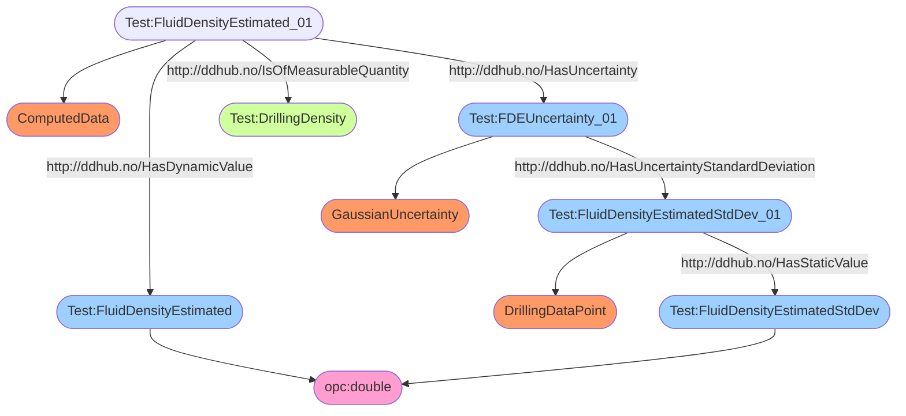
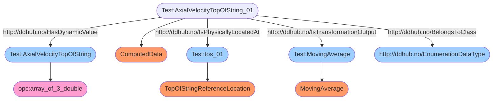

# Semantic Graph for `FluidDensityEstimated`

```mermaid
flowchart TD
	 classDef typeClass fill:#f96;
	 classDef classClass fill:#9dd0ff;
	 classDef opcClass fill:#ff9dd0;
	 classDef quantityClass fill:#d0ff9d;
	Test:FluidDensityEstimated([Test:FluidDensityEstimated]) --> opc:double([opc:double]):::opcClass
	Test:FluidDensityEstimatedStdDev([Test:FluidDensityEstimatedStdDev]) --> opc:double([opc:double]):::opcClass
	Test:FluidDensityEstimated_01([Test:FluidDensityEstimated_01]) --> ComputedData([ComputedData]):::typeClass
	Test:FDEUncertainty_01([Test:FDEUncertainty_01]) --> GaussianUncertainty([GaussianUncertainty]):::typeClass
	Test:FluidDensityEstimatedStdDev_01([Test:FluidDensityEstimatedStdDev_01]) --> DrillingDataPoint([DrillingDataPoint]):::typeClass
	Test:FluidDensityEstimated_01([Test:FluidDensityEstimated_01]) -- http://ddhub.no/HasDynamicValue --> Test:FluidDensityEstimated([Test:FluidDensityEstimated]):::classClass
	Test:FluidDensityEstimated_01([Test:FluidDensityEstimated_01]) -- http://ddhub.no/IsOfMeasurableQuantity --> Test:DrillingDensity([Test:DrillingDensity]):::quantityClass
	Test:FluidDensityEstimated_01([Test:FluidDensityEstimated_01]) -- http://ddhub.no/HasUncertainty --> Test:FDEUncertainty_01([Test:FDEUncertainty_01]):::classClass
	Test:FluidDensityEstimatedStdDev_01([Test:FluidDensityEstimatedStdDev_01]) -- http://ddhub.no/HasStaticValue --> Test:FluidDensityEstimatedStdDev([Test:FluidDensityEstimatedStdDev]):::classClass
	Test:FDEUncertainty_01([Test:FDEUncertainty_01]) -- http://ddhub.no/HasUncertaintyStandardDeviation --> Test:FluidDensityEstimatedStdDev_01([Test:FluidDensityEstimatedStdDev_01]):::classClass
```

# Semantic Graph for `FluidDensityMeasured`

```mermaid
flowchart TD
	 classDef typeClass fill:#f96;
	 classDef classClass fill:#9dd0ff;
	 classDef opcClass fill:#ff9dd0;
	 classDef quantityClass fill:#d0ff9d;
	Test:FluidDensityMeasured([Test:FluidDensityMeasured]) --> opc:double([opc:double]):::opcClass
	Test:FluidDensityMeasured_acc([Test:FluidDensityMeasured_acc]) --> opc:double([opc:double]):::opcClass
	Test:FluidDensityMeasured_prec([Test:FluidDensityMeasured_prec]) --> opc:double([opc:double]):::opcClass
	Test:FluidDensityMeasured_01([Test:FluidDensityMeasured_01]) --> PhysicalData([PhysicalData]):::typeClass
	Test:tos_01([Test:tos_01]) --> TopOfStringReferenceLocation([TopOfStringReferenceLocation]):::typeClass
	Test:MovingAverage([Test:MovingAverage]) --> MovingAverage([MovingAverage]):::typeClass
	Test:FluidDensityMeasured_prec_01([Test:FluidDensityMeasured_prec_01]) --> DrillingDataPoint([DrillingDataPoint]):::typeClass
	Test:FluidDensityMeasured_acc_01([Test:FluidDensityMeasured_acc_01]) --> DrillingDataPoint([DrillingDataPoint]):::typeClass
	Test:SensorUncertainty_01([Test:SensorUncertainty_01]) --> SensorUncertainty([SensorUncertainty]):::typeClass
	Test:FluidDensityMeasured_01([Test:FluidDensityMeasured_01]) -- http://ddhub.no/HasDynamicValue --> Test:FluidDensityMeasured([Test:FluidDensityMeasured]):::classClass
	Test:FluidDensityMeasured_01([Test:FluidDensityMeasured_01]) -- http://ddhub.no/IsOfMeasurableQuantity --> Test:DrillingDensity([Test:DrillingDensity]):::quantityClass
	Test:FluidDensityMeasured_01([Test:FluidDensityMeasured_01]) -- http://ddhub.no/IsPhysicallyLocatedAt --> Test:tos_01([Test:tos_01]):::classClass
	Test:FluidDensityMeasured_01([Test:FluidDensityMeasured_01]) -- http://ddhub.no/IsTransformationOutput --> Test:MovingAverage([Test:MovingAverage]):::classClass
	Test:FluidDensityMeasured_prec_01([Test:FluidDensityMeasured_prec_01]) -- http://ddhub.no/HasValue --> Test:FluidDensityMeasured_prec([Test:FluidDensityMeasured_prec]):::classClass
	Test:FluidDensityMeasured_acc_01([Test:FluidDensityMeasured_acc_01]) -- http://ddhub.no/HasValue --> Test:FluidDensityMeasured_acc([Test:FluidDensityMeasured_acc]):::classClass
	Test:SensorUncertainty_01([Test:SensorUncertainty_01]) -- http://ddhub.no/HasUncertaintyPrecision --> Test:FluidDensityMeasured_prec_01([Test:FluidDensityMeasured_prec_01]):::classClass
	Test:SensorUncertainty_01([Test:SensorUncertainty_01]) -- http://ddhub.no/HasUncertaintyAccuracy --> Test:FluidDensityMeasured_acc_01([Test:FluidDensityMeasured_acc_01]):::classClass
	Test:FluidDensityMeasured_01([Test:FluidDensityMeasured_01]) -- http://ddhub.no/HasUncertainty --> Test:SensorUncertainty_01([Test:SensorUncertainty_01]):::classClass
	Test:SensorUncertainty_01([Test:SensorUncertainty_01]) -- http://ddhub.no/HasUncertaintyMean --> Test:FluidDensityMeasured_01([Test:FluidDensityMeasured_01]):::classClass
```

# Semantic Graph for `AxialVelocityTopOfString`

```mermaid
flowchart TD
	 classDef typeClass fill:#f96;
	 classDef classClass fill:#9dd0ff;
	 classDef opcClass fill:#ff9dd0;
	 classDef quantityClass fill:#d0ff9d;
	Test:AxialVelocityTopOfString([Test:AxialVelocityTopOfString]) --> opc:array_of_3_double([opc:array_of_3_double]):::opcClass
	Test:AxialVelocityTopOfString_01([Test:AxialVelocityTopOfString_01]) --> ComputedData([ComputedData]):::typeClass
	Test:tos_01([Test:tos_01]) --> TopOfStringReferenceLocation([TopOfStringReferenceLocation]):::typeClass
	Test:MovingAverage([Test:MovingAverage]) --> MovingAverage([MovingAverage]):::typeClass
	Test:AxialVelocityTopOfString_01([Test:AxialVelocityTopOfString_01]) -- http://ddhub.no/BelongsToClass --> http://ddhub.no/EnumerationDataType([http://ddhub.no/EnumerationDataType]):::classClass
	Test:AxialVelocityTopOfString_01([Test:AxialVelocityTopOfString_01]) -- http://ddhub.no/HasDynamicValue --> Test:AxialVelocityTopOfString([Test:AxialVelocityTopOfString]):::classClass
	Test:AxialVelocityTopOfString_01([Test:AxialVelocityTopOfString_01]) -- http://ddhub.no/IsPhysicallyLocatedAt --> Test:tos_01([Test:tos_01]):::classClass
	Test:AxialVelocityTopOfString_01([Test:AxialVelocityTopOfString_01]) -- http://ddhub.no/IsTransformationOutput --> Test:MovingAverage([Test:MovingAverage]):::classClass
```

