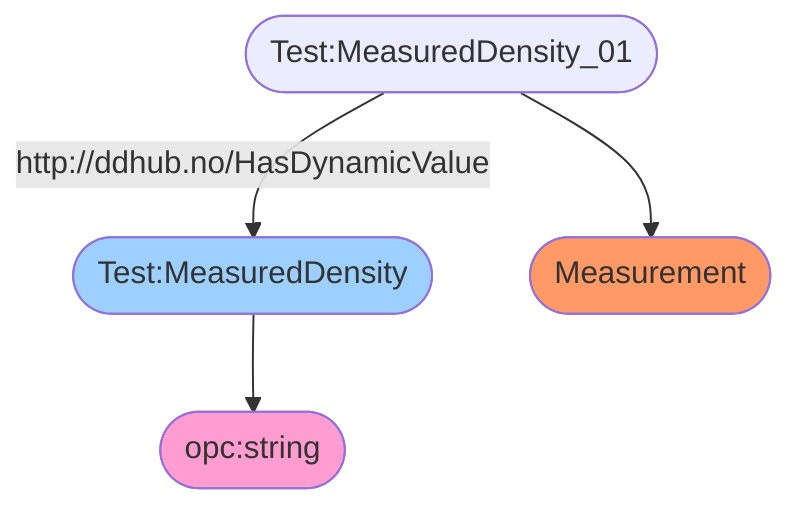
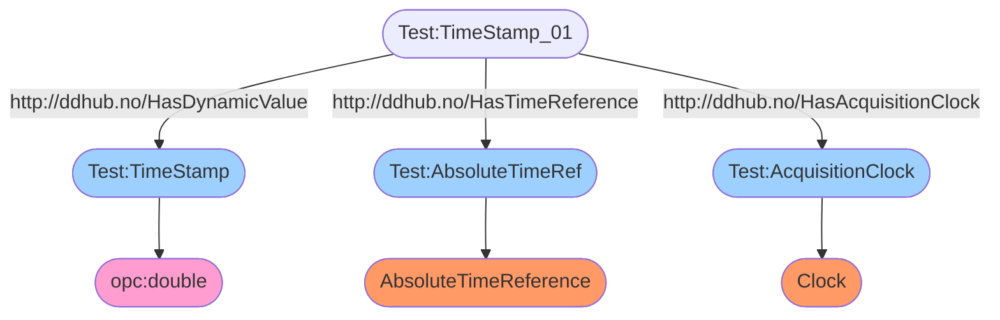
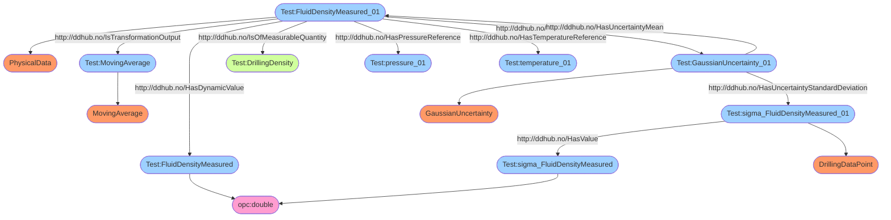
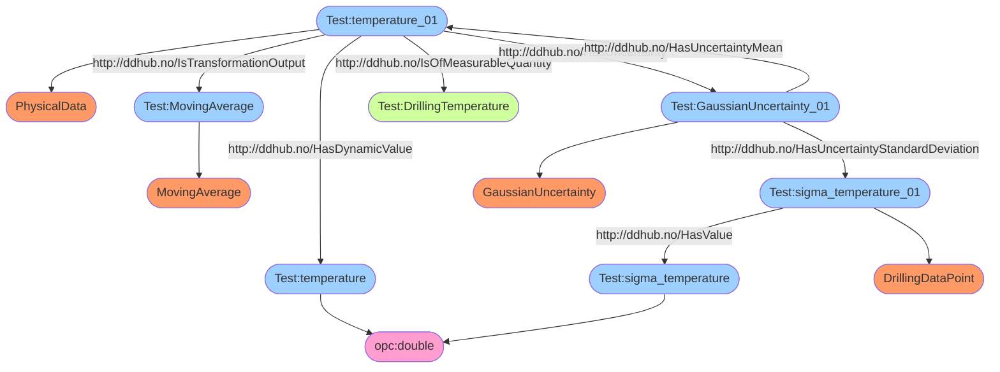
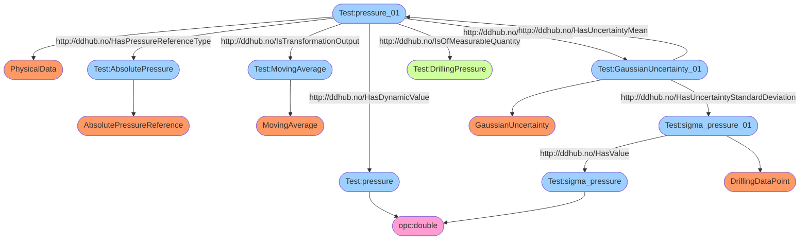

# Semantic Graph for `MeasuredFluidDensity`

```mermaid
flowchart TD
	 classDef typeClass fill:#f96;
	 classDef classClass fill:#9dd0ff;
	 classDef opcClass fill:#ff9dd0;
	 classDef quantityClass fill:#d0ff9d;
	Test:MeasuredDensity([Test:MeasuredDensity]) --> opc:string([opc:string]):::opcClass
	Test:MeasuredDensity_01([Test:MeasuredDensity_01]) --> Measurement([Measurement]):::typeClass
	Test:MeasuredDensity_01([Test:MeasuredDensity_01]) -- http://ddhub.no/HasDynamicValue --> Test:MeasuredDensity([Test:MeasuredDensity]):::classClass
```

# Semantic Graph for `TimeStamp`

```mermaid
flowchart TD
	 classDef typeClass fill:#f96;
	 classDef classClass fill:#9dd0ff;
	 classDef opcClass fill:#ff9dd0;
	 classDef quantityClass fill:#d0ff9d;
	Test:TimeStamp([Test:TimeStamp]) --> opc:double([opc:double]):::opcClass
	Test:AbsoluteTimeRef([Test:AbsoluteTimeRef]) --> AbsoluteTimeReference([AbsoluteTimeReference]):::typeClass
	Test:AcquisitionClock([Test:AcquisitionClock]) --> Clock([Clock]):::typeClass
	Test:TimeStamp_01([Test:TimeStamp_01]) -- http://ddhub.no/HasDynamicValue --> Test:TimeStamp([Test:TimeStamp]):::classClass
	Test:TimeStamp_01([Test:TimeStamp_01]) -- http://ddhub.no/HasTimeReference --> Test:AbsoluteTimeRef([Test:AbsoluteTimeRef]):::classClass
	Test:TimeStamp_01([Test:TimeStamp_01]) -- http://ddhub.no/HasAcquisitionClock --> Test:AcquisitionClock([Test:AcquisitionClock]):::classClass
```

# Semantic Graph for `MassDensity`

```mermaid
flowchart TD
	 classDef typeClass fill:#f96;
	 classDef classClass fill:#9dd0ff;
	 classDef opcClass fill:#ff9dd0;
	 classDef quantityClass fill:#d0ff9d;
	Test:FluidDensityMeasured([Test:FluidDensityMeasured]) --> opc:double([opc:double]):::opcClass
	Test:sigma_FluidDensityMeasured([Test:sigma_FluidDensityMeasured]) --> opc:double([opc:double]):::opcClass
	Test:FluidDensityMeasured_01([Test:FluidDensityMeasured_01]) --> PhysicalData([PhysicalData]):::typeClass
	Test:MovingAverage([Test:MovingAverage]) --> MovingAverage([MovingAverage]):::typeClass
	Test:sigma_FluidDensityMeasured_01([Test:sigma_FluidDensityMeasured_01]) --> DrillingDataPoint([DrillingDataPoint]):::typeClass
	Test:GaussianUncertainty_01([Test:GaussianUncertainty_01]) --> GaussianUncertainty([GaussianUncertainty]):::typeClass
	Test:FluidDensityMeasured_01([Test:FluidDensityMeasured_01]) -- http://ddhub.no/HasDynamicValue --> Test:FluidDensityMeasured([Test:FluidDensityMeasured]):::classClass
	Test:FluidDensityMeasured_01([Test:FluidDensityMeasured_01]) -- http://ddhub.no/IsOfMeasurableQuantity --> Test:DrillingDensity([Test:DrillingDensity]):::quantityClass
	Test:FluidDensityMeasured_01([Test:FluidDensityMeasured_01]) -- http://ddhub.no/IsTransformationOutput --> Test:MovingAverage([Test:MovingAverage]):::classClass
	Test:FluidDensityMeasured_01([Test:FluidDensityMeasured_01]) -- http://ddhub.no/HasPressureReference --> Test:pressure_01([Test:pressure_01]):::classClass
	Test:FluidDensityMeasured_01([Test:FluidDensityMeasured_01]) -- http://ddhub.no/HasTemperatureReference --> Test:temperature_01([Test:temperature_01]):::classClass
	Test:sigma_FluidDensityMeasured_01([Test:sigma_FluidDensityMeasured_01]) -- http://ddhub.no/HasValue --> Test:sigma_FluidDensityMeasured([Test:sigma_FluidDensityMeasured]):::classClass
	Test:FluidDensityMeasured_01([Test:FluidDensityMeasured_01]) -- http://ddhub.no/HasUncertainty --> Test:GaussianUncertainty_01([Test:GaussianUncertainty_01]):::classClass
	Test:GaussianUncertainty_01([Test:GaussianUncertainty_01]) -- http://ddhub.no/HasUncertaintyStandardDeviation --> Test:sigma_FluidDensityMeasured_01([Test:sigma_FluidDensityMeasured_01]):::classClass
	Test:GaussianUncertainty_01([Test:GaussianUncertainty_01]) -- http://ddhub.no/HasUncertaintyMean --> Test:FluidDensityMeasured_01([Test:FluidDensityMeasured_01]):::classClass
```

# Semantic Graph for `Temperature`

```mermaid
flowchart TD
	 classDef typeClass fill:#f96;
	 classDef classClass fill:#9dd0ff;
	 classDef opcClass fill:#ff9dd0;
	 classDef quantityClass fill:#d0ff9d;
	Test:temperature([Test:temperature]) --> opc:double([opc:double]):::opcClass
	Test:sigma_temperature([Test:sigma_temperature]) --> opc:double([opc:double]):::opcClass
	Test:temperature_01([Test:temperature_01]) --> PhysicalData([PhysicalData]):::typeClass
	Test:MovingAverage([Test:MovingAverage]) --> MovingAverage([MovingAverage]):::typeClass
	Test:sigma_temperature_01([Test:sigma_temperature_01]) --> DrillingDataPoint([DrillingDataPoint]):::typeClass
	Test:GaussianUncertainty_01([Test:GaussianUncertainty_01]) --> GaussianUncertainty([GaussianUncertainty]):::typeClass
	Test:temperature_01([Test:temperature_01]) -- http://ddhub.no/HasDynamicValue --> Test:temperature([Test:temperature]):::classClass
	Test:temperature_01([Test:temperature_01]) -- http://ddhub.no/IsOfMeasurableQuantity --> Test:DrillingTemperature([Test:DrillingTemperature]):::quantityClass
	Test:temperature_01([Test:temperature_01]) -- http://ddhub.no/IsTransformationOutput --> Test:MovingAverage([Test:MovingAverage]):::classClass
	Test:sigma_temperature_01([Test:sigma_temperature_01]) -- http://ddhub.no/HasValue --> Test:sigma_temperature([Test:sigma_temperature]):::classClass
	Test:temperature_01([Test:temperature_01]) -- http://ddhub.no/HasUncertainty --> Test:GaussianUncertainty_01([Test:GaussianUncertainty_01]):::classClass
	Test:GaussianUncertainty_01([Test:GaussianUncertainty_01]) -- http://ddhub.no/HasUncertaintyStandardDeviation --> Test:sigma_temperature_01([Test:sigma_temperature_01]):::classClass
	Test:GaussianUncertainty_01([Test:GaussianUncertainty_01]) -- http://ddhub.no/HasUncertaintyMean --> Test:temperature_01([Test:temperature_01]):::classClass
```

# Semantic Graph for `Pressure`

```mermaid
flowchart TD
	 classDef typeClass fill:#f96;
	 classDef classClass fill:#9dd0ff;
	 classDef opcClass fill:#ff9dd0;
	 classDef quantityClass fill:#d0ff9d;
	Test:pressure([Test:pressure]) --> opc:double([opc:double]):::opcClass
	Test:sigma_pressure([Test:sigma_pressure]) --> opc:double([opc:double]):::opcClass
	Test:pressure_01([Test:pressure_01]) --> PhysicalData([PhysicalData]):::typeClass
	Test:AbsolutePressure([Test:AbsolutePressure]) --> AbsolutePressureReference([AbsolutePressureReference]):::typeClass
	Test:MovingAverage([Test:MovingAverage]) --> MovingAverage([MovingAverage]):::typeClass
	Test:sigma_pressure_01([Test:sigma_pressure_01]) --> DrillingDataPoint([DrillingDataPoint]):::typeClass
	Test:GaussianUncertainty_01([Test:GaussianUncertainty_01]) --> GaussianUncertainty([GaussianUncertainty]):::typeClass
	Test:pressure_01([Test:pressure_01]) -- http://ddhub.no/HasDynamicValue --> Test:pressure([Test:pressure]):::classClass
	Test:pressure_01([Test:pressure_01]) -- http://ddhub.no/IsOfMeasurableQuantity --> Test:DrillingPressure([Test:DrillingPressure]):::quantityClass
	Test:pressure_01([Test:pressure_01]) -- http://ddhub.no/HasPressureReferenceType --> Test:AbsolutePressure([Test:AbsolutePressure]):::classClass
	Test:pressure_01([Test:pressure_01]) -- http://ddhub.no/IsTransformationOutput --> Test:MovingAverage([Test:MovingAverage]):::classClass
	Test:sigma_pressure_01([Test:sigma_pressure_01]) -- http://ddhub.no/HasValue --> Test:sigma_pressure([Test:sigma_pressure]):::classClass
	Test:pressure_01([Test:pressure_01]) -- http://ddhub.no/HasUncertainty --> Test:GaussianUncertainty_01([Test:GaussianUncertainty_01]):::classClass
	Test:GaussianUncertainty_01([Test:GaussianUncertainty_01]) -- http://ddhub.no/HasUncertaintyStandardDeviation --> Test:sigma_pressure_01([Test:sigma_pressure_01]):::classClass
	Test:GaussianUncertainty_01([Test:GaussianUncertainty_01]) -- http://ddhub.no/HasUncertaintyMean --> Test:pressure_01([Test:pressure_01]):::classClass
```

