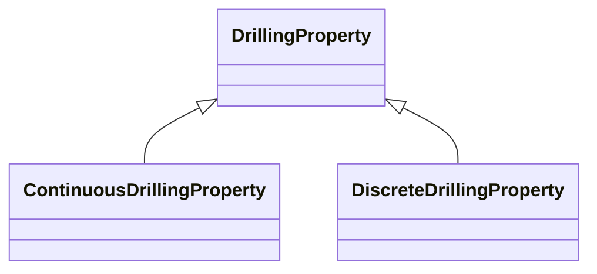
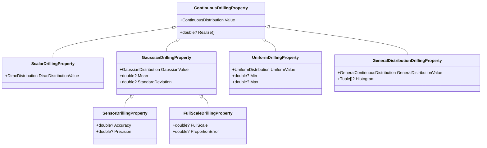
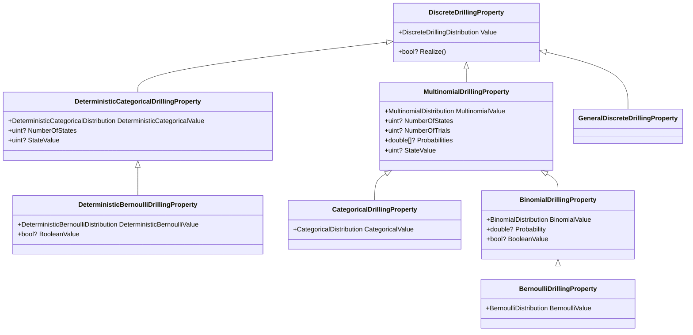
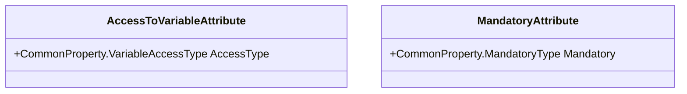
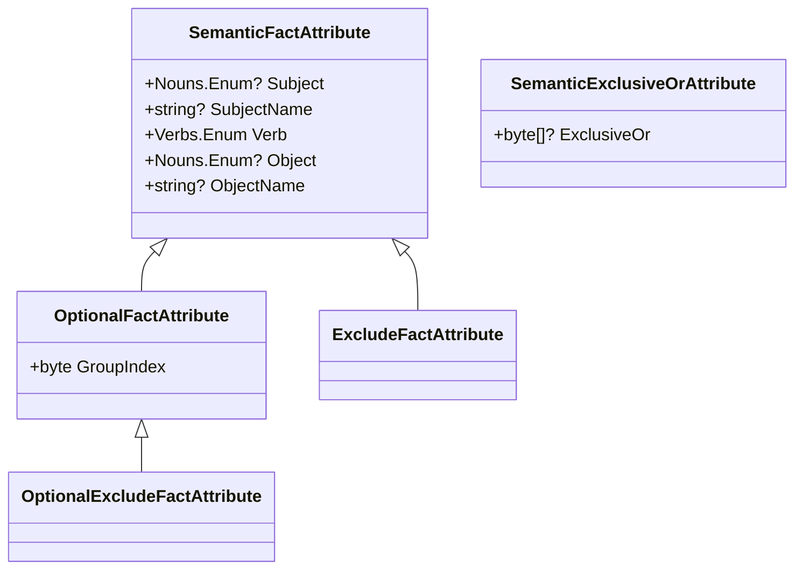
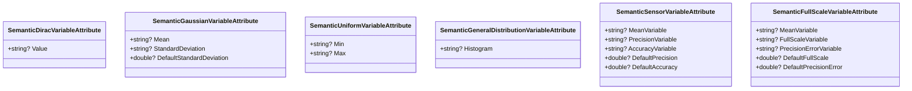
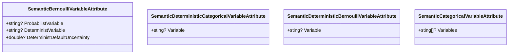
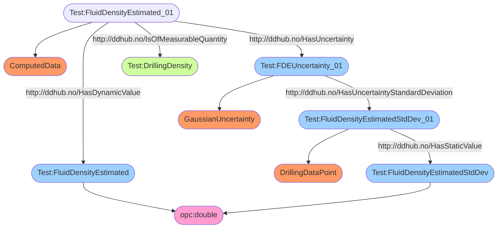
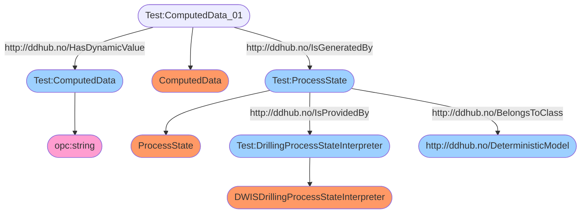

# Background
This package is developed as part of the Society of Petroleum (SPE) Open Source Drilling Community, a sub-committee of the Drilling System Automation Technical Section.

# Purpose
The purpose of this package is to provide a way to describe drilling properties and their uncertainty. There are also Attributes
that allow to decorate the properties. There is also a function to generate a dictionary of the decorations associated with
the drilling properties that can therefore be serialized in json.

# Principles

There are two groups of drilling properties:
- the continuous drilling properties
- the discrete drilling properties

A `DrillingProperty` is an abstract class.



## Continuous Drilling Properties
A `ContinuousDrillingProperty` is an abstract class that defines one property: `Value`. A `Value` is a `ContinuousDistribution` 
and therefore represents any continuous probability distrutions. `ContinuousDistribution`and other probability distributions are defined
in `OSDC.DotnetLibraries.General.Statistics`, which is available as a nuget on nuget.org 
([see here](https://www.nuget.org/packages/OSDC.DotnetLibraries.General.Statistics/)). `ContinuousDrillingProperty` has a method called `Realize` that is used to draw a value (`double?`) using the
probability distribution defined in `Value`. It may return `null`.

`ContinuousDrillingProperty`has four direct sub-classes:
- `ScalarDrillingProperty`: used to represent a scalar value with no uncertainty. The value is maintained as a `DiracDistribution`. 
There is a redefinition of the `Value` property which is strongly typed to `DiracDistribution`. It is called `DiracDistributionValue`. 
The `Value` property points to the value contained in `DiracDistrutionValue`. The `Realize` method always returns the value of the
`DiracDistribution` or `null` if the value is not defined. So the `ScalarDrillingProperty` is equivalent to a fixed value. A convenience
property is defined and is called `ScalarValue`. It allows to directly access  the `Value` of the `DiracDistribution`.
- `GaussianDrillingProperty`: used to represent normal distributions defined by a `Mean` and a `StandardDeviation`. The probability
distribution is defined as a `GaussianDistribution`. In order to benefits from strong typing, a property called `GaussianValue` is defined
of the type `GaussianDistribution`. The `Value` property is redefined to point to the instance managed by `GaussianValue`. The `Realize` method
produces values between -&infin; and +&infin; with a mean value corresponding to the `Mean` of the `GaussianValue` and with a 
standard deviation also defined in the `GaussianValue`. For conveniance, there are two additional properties that are defined: `Mean` and
`StandardDeviation`. They allow to access directly the `Mean` and the `StandardDeviation`(respectively) of the `GaussianValue`.
    - `SensorDrillingProperty`: used to represent normal distributions for a sensor. Often, the characteristics of the sensor are given
    with an `Accuracy` and a `Precision`. The overall standard deviation is calculated as $\sqrt{\sigma^2{_a}+\sigma^2{_p}}$ 
    where $\sigma_a$ is the accuracy and $\sigma_p$ is the precision. A `Mean` property is defined locally. It is a synonym of the `Mean`
    value of the underlying Gaussian probability distribution, which is still accessible through the property `GaussianValue`.
    - `FullScaleDrillingProperty`: used to represent normal distributions for a sensor. Here, the characteristics of the sensor are given
    with a proportion of the full-scale range of the measurement. The property `ProportionError` contains a value between 0 and 1.
    The property `FullScale` contains the max range for the measurement. The standard deviation of the Gaussian probability distribution
    is the product of the `ProportionError` by the `FullScale`. A `Mean` property is defined locally. It is a synonym of the `Mean`
    value of the underlying Gaussian probability distribution, which is still accessible through the property `GaussianValue`.
- `UniformDrillingProperty`: used to represent a uniform distritution between two values, `Min` and `Max`. The probability
distribution is defined as a `UniformDistribution`. A property of type `UniformDistribution` is defined: `UniformValue`. The 
property `Value` is redefined to point to the instance managed by `UniformValue`. The realize method draws uniformely values
in between `Min` and `Max`. There are two properties that are defined for convenience: `Min` and `Max`. They allow, respectively, to 
access the `Min` and the `Max` of the `UniformDistribution`.
- `GeneralDistributionDrillingProperty`: used to represent a general probability distribution managed as a histogram. The value
is defined by a `GeneralContinuousDistribution` and accessible using the property `GeneralDistributionValue`. The `Value` property is redefined to point to the instance 
managed by `GeneralDistributionValue`. The `GeneralContinuousDistribution` can be defined either by a data set stored in `Data`.
In that case, an histogram is generated from the data set, which is stored in `Function`. Or directly as a given histogram stored in `Function`.
An histogram is represented as an array of `Tuple<double, double>` for which `Item1` is the value of the bin and `Item2` is the
probability of the bin. There is an additional property, defined for convinience, to access directly the `Function` of the `GeneralContinuousDistribution`.
It is called `Histogram`.



## Example
Here is an example. 

```csharp
using OSDC.DotnetLibraries.Drilling.DrillingProperties;
using System.Globalization;

namespace DrillingProperties
{
    class TestClass
    {
        public ScalarDrillingProperty Value1 { get; set; } = new ScalarDrillingProperty();
        public UniformDrillingProperty Value2 { get; set; } = new UniformDrillingProperty();
        public GaussianDrillingProperty Value3 { get; set; } = new GaussianDrillingProperty();
        public GeneralDistributionDrillingProperty Value4 { get; set; } = new GeneralDistributionDrillingProperty();
        public SensorDrillingProperty Value5 { get; set; } = new SensorDrillingProperty();
        public FullScaleDrillingProperty Value6 { get; set; }= new FullScaleDrillingProperty();
    }
    class Example
    {
        static void Main()
        {
            TestClass testClass = new TestClass();
            testClass.Value1.ScalarValue = 1.0;
            testClass.Value2.Min = -1.0;
            testClass.Value2.Max = 1.0;
            testClass.Value3.Mean = 10.0;
            testClass.Value3.StandardDeviation = 0.5;
            testClass.Value4.Histogram = new Tuple<double, double>[] {
                new Tuple<double, double>(0.0, 0.1),
                new Tuple<double, double>(1.0, 0.2),
                new Tuple<double, double>(2.0, 0.3),
                new Tuple<double, double>(3.0, 0.4)
            };
            testClass.Value5.Accuracy = 0.1;
            testClass.Value5.Precision = 0.01;
            testClass.Value5.Mean = 1.0;
            testClass.Value6.FullScale = 10.0;
            testClass.Value6.ProportionError = 0.001;
            testClass.Value6.Mean = 1.0;
            for (int i = 0; i < 10; i++)
            {
                Realize(testClass);
            }
        }

        static void Realize(TestClass testClass)
        {
            double? value1 = testClass.Value1.Realize();
            double? value2 = testClass.Value2.Realize();
            double? value3 = testClass.Value3.Realize();
            double? value4 = testClass.Value4.Realize();
            double? value5 = testClass.Value5.Realize();
            double? value6 = testClass.Value6.Realize();
            Console.WriteLine("Realized values:" +
                " value1 = " + value1?.ToString("F", CultureInfo.InvariantCulture) +
                " value2 = " + value2?.ToString("F", CultureInfo.InvariantCulture) +
                " value3 = " + value3?.ToString("F", CultureInfo.InvariantCulture) +
                " value4 = " + value4?.ToString("F", CultureInfo.InvariantCulture) +
                " value5 = " + value5?.ToString("F", CultureInfo.InvariantCulture) +
                " value6 = " + value6?.ToString("F", CultureInfo.InvariantCulture));
        }
    }
}
```


The execution of the program gives:

```
Realized values: value1 = 1.00 value2 = 0.58 value3 = 10.14 value4 = 2.98 value5 = 0.93 value6 = 1.01
Realized values: value1 = 1.00 value2 = 0.12 value3 = 10.75 value4 = 1.22 value5 = 0.85 value6 = 0.99
Realized values: value1 = 1.00 value2 = -0.98 value3 = 10.76 value4 = 2.40 value5 = 0.95 value6 = 0.99
Realized values: value1 = 1.00 value2 = -0.23 value3 = 9.05 value4 = 2.65 value5 = 1.01 value6 = 1.01
Realized values: value1 = 1.00 value2 = 0.51 value3 = 10.45 value4 = 0.74 value5 = 1.09 value6 = 0.99
Realized values: value1 = 1.00 value2 = -0.83 value3 = 10.35 value4 = 1.65 value5 = 0.98 value6 = 0.99
Realized values: value1 = 1.00 value2 = 0.06 value3 = 10.62 value4 = 1.48 value5 = 0.96 value6 = 1.01
Realized values: value1 = 1.00 value2 = 0.46 value3 = 10.11 value4 = 0.25 value5 = 0.77 value6 = 1.01
Realized values: value1 = 1.00 value2 = 0.38 value3 = 9.99 value4 = 0.96 value5 = 1.21 value6 = 1.00
Realized values: value1 = 1.00 value2 = 0.74 value3 = 9.61 value4 = 2.94 value5 = 0.95 value6 = 1.01
```

## Discrete Drilling Properties
Similarly, there is an abstract class called `DiscreteDrillingProperty` to describe booleans or enumerated values. It has also a property called `Value`, which is a 
`DiscreteDistribution`. It has three direct sub-classes:
- `DeterministicBooleanDrillingProperty`: used to represent a boolean value with no uncertainty, i.e., deterministic. It defines a specific property called `DeterministicDiscreteProperty`
that allows to access with the correct type the underlying statistical probability distribution. It has a `Probability` property which returns the probability of the underlying
`DeterministicDiscreteDistribution` for the target `0`. It has also a `BooleanValue` that defines the boolean state of the instance, which is deterministic for this class.
- `CategoricalDrillingProperty`: used to represent a multinomial value with uncertainty. The `NumberOfStates` property defines how many
state the drilling property can take. It should be at least 2. The `Probabilities` property defines the probability of each of the states.
The `StateValue` tells which state has the largest probability. If assigned, then that state gets a probability of 1 and all the others 
a zero probability.
- `BernoulliDrillingProperty`: used to represent a boolean value with an uncertainty. It is subclass of `CategoricalDrillingProperty` for which
- te number of states is 2. The `Probability` property is used to define the uncertainty. The `BooleanValue` property
is true if the `Probability` is greater than 0.5 and false otherwise. 
- `GeneralDiscreteDrillingProperty`: used to represent a general discrete probability for a boolean value.



# Providing Meta Information
There is the possibility to provide meta information with the declation of a `DrillingProperty` or of a `class` or a `struct`.
In the case of a `class` or a `struct`, the meta information are associated with instances of these `class`
or `struct` seen as if they were serialized, typically in `json`. This is achieved using
specific attributes. The possible attributes are:
- `AccessToVariableAttribute` : It takes one argument of the type `CommonProperty.VariableAccessType`. This attribute is used to inform whether
the property will be only fetched (`CommonProperty.VariableAccessType.Readable`) or if it can be assigned (`CommonProperty.VariableAccessType.Assignable`).
In relation with the semantic definition of the property that is interpreted as the semantic will be turned into a sparql query (readable)
or it will be used to inject the semantic in the DDHub (assignable).
- `MandatoryAttribute`: It takes one argument of the type `CommonProperty.MandatoryType`. This attribute is used to inform whether
the property is mandatory and in the affirmative in which context. The value `General` means that it is always mandatory.
The value `None` means that it is always optional. Other values can be combined together using a logical "or", therefore allowing
to state that the property can be mandatory in one or several context. Example contexts are: `Mechanical`, `Hydraulic`, `Directional`, ...
This attribute shall be defined only once for the property.
- `SemanticFactAttribute`: It takes two, three or more arguments: `Subject`, `Verb` and `Object`. `Subject` and `Object` belongs to either the enumeration
`Nouns.Enum` or a `string`, while `Verb` is a choice from the enum `Verbs.Enum`. If `Verb` is ommitted then it is supposed to be `BelongsToClass` and the `Object`
must be a `Nouns.Enum`. Both `Nouns.Enum` and `Verbs.Enum` are defined in the library
`DWIS.Vocabulary.Schemas` which contains the vocabulary defined in the D-WIS project (see [D-WIS.org](https://d-wis.org/)). If there are more
than three arguments, the additional one must come in pair and are strings. They correspond to `attribute` and `value` for the `Object`. This 
attribute is used to defined a true assertion about that property. The use of a `string` for the `Subject` or the `Object` is to
refer to internal variables of the semantic definition. This attribute can be used multiple times therefore allowing
to describe multiple facts about the property, i.e., a semantic network.
    - `OptionalFactAttribute`: It is a subclass of `SemanticFactAttribute`. When the property has an attribute `AccessToVariableAttribute`
    that is set to readable, and therefore a sparql query will be generated to populate the value of the property, then `OptionalFactAttribute`
    may be dropped in the sparql query in case there are no matching data. `OptionalFactAttribute` has an additional property called `GroupIndex`, a `byte`.
    The purpose of `GroupIndex` is to state that a set of `OptionalFactAttribute` are bound together when they use the same value for `GroupIndex`.
    This information is used to generate the multiple variant of Sparql queries that result from the combinatorial choices related to the `OptionalFactAttribute`.
    It can also have both a `ParentGroupIndex` and a `GroupIndex`. In that case, this is an option relative to the `ParentGroupIndex` option.
    - `ExcludeFact` and `OptionalExcludeFact` are used to define facts that will exclude data in a SparQL query, meaning that if the fact is present
    then the query will not select this data. The difference between `ExcludeFact` and `OptionalExcludeFact` is that an `ExcludeFact` is always tested 
    while an `OptionalExcludeFact` will be tested only for the optional group index.
- `SemanticDiracVariableAttribute`: It takes one argument that is the name used for a `DrillingSignal` that will be used for the `Value` of this
property.
- `SemanticGaussianVariableAttribute`: It takes 2 arguments or 3 arguments. The first one is the name of a `DrillingSignal` used in the semantic facts
 that is used as the `Mean` value of this property. The second argument is the name of a `DrillingSignal` used in the semantic facts
 and that is used as the `StandardDeviation` value of this property. The third one is a default 
 value for the `StandardDeviation`.
- `SemanticSensorVariableAttribute`: It takes from 3 to 5 arguments. The three string arguments are
respectively the variable names for the `Mean`, `Precision` and `Accuracy`. The two double arguments are
respectively the default values for the `Precision` and `Accuracy`.
- `SemanticFullScaleAttribute`: It takes from 3 to 5 arguments. The three string arguments are
respectively the variable names for the `Mean`, `FullScale` and `ProportionError`. The two double  arguments are
respectively the default values for the `FullScale` and `ProportionError`.
- `SemanticUniformVariableAttribute`: It takes two arguments that are the names of a `DrillingSignal` used in the semantic facts
that are used as the `Min` and the `Max` value of this property.
- `SemanticGeneralDistributionVariableAttribute`: It takes one argument that is the name of a `DrillingSignal` used in the semantic facts
to access the `Histogram` value of this property.
- `SemanticBernoulliVariableAttribute`: It takes one to three arguments. The `string` arguments represent
either the stochastic or the probabilistic variables that are used in the semantic facts. A `double` argument
is used to define a default deterministic uncertainty. 
- `SemanticCategoricalVariableAttribute`: It takes as many arguments as there are states for the corresponding `CategoricalDrillingProperty`.
- `SemanticDeterministicCategoricalVariableAttribute`: It takes one argument that is the name of a `DrillingSignal` used
in the semantic facts to describe the value a `DeterministicCategoricalDrillingProperty`.
- `SemanticDeterministicBernoulliVariableAttribute`: It takes one argument that is the name of a `DrillingSignal` used
in the semantic facts to describe the value a `DeterministicBernoulliDrillingProperty`.
- `SemanticExclusiveOrAttribute`: It takes at least 2 arguments. This attribute is used to defined
a list of the optional semantic facts that are exclusive from each other's. 






## Example
Here is an example:

```csharp
using OSDC.DotnetLibraries.Drilling.DrillingProperties;
using OSDC.UnitConversion.Conversion;
using OSDC.UnitConversion.Conversion.DrillingEngineering;
using DWIS.Vocabulary.Schemas;

namespace DrillingProperties
{
    public class TestClass
    {
        [AccessToVariable(CommonProperty.VariableAccessType.Assignable)]
        [Mandatory(CommonProperty.MandatoryType.General)]
        [SemanticGaussianVariable("BitDepthValue#01", "BitDepthStandardDeviationValue#01")]
        [SemanticFact("BitDepthValue#01", Nouns.Enum.DynamicDrillingSignal)]
        [SemanticFact("BitDepth#01", Nouns.Enum.BitDepth)]
        [SemanticFact("BitDepth#01", Verbs.Enum.IsOfMeasurableQuantity, DrillingPhysicalQuantity.QuantityEnum.Depth)]
        [SemanticFact("BitDepth#01", Nouns.Enum.DerivedMeasurement)]
        [SemanticFact("BitDepth#01", Verbs.Enum.HasDynamicValue, "BitDepthValue#01")]
        [SemanticFact("BitDepth#01", Verbs.Enum.IsMechanicallyLocatedAt, "Bit#01")]
        [SemanticFact("WGS84VerticalDatum", Nouns.Enum.WGS84VerticalLocation)]
        [SemanticFact("VerticalDepthFrame", Nouns.Enum.VerticalDepthFrame)]
        [SemanticFact("VerticalDepthFrame", Verbs.Enum.HasReferenceFrameOrigin, "WGS84VerticalDatum")]
        [SemanticFact("BitDepth#01", Verbs.Enum.HasReferenceFrame, "VerticalDepthFrame")]
        [SemanticFact("Bit#01", Nouns.Enum.DrillingBit)]
        [SemanticFact("BitDepthStandardDeviation#01", Nouns.Enum.DrillingDataPoint)]
        [SemanticFact("BitDepthStandardDeviationValue#01", Nouns.Enum.DynamicDrillingSignal)]
        [SemanticFact("BitDepthStandardDeviation#01", Verbs.Enum.HasDynamicValue, "BitDepthStandardDeviationValue#01")]
        [SemanticFact("GaussianUncertainty#01", Nouns.Enum.GaussianUncertainty)]
        [SemanticFact("BitDepth#01", Verbs.Enum.HasUncertainty, "GaussianUncertainty")]
        [SemanticFact("GaussianUncertainty#01", Verbs.Enum.HasUncertaintyStandardDeviation, "BitDepthStandardDeviation#01")]
        public GaussianDrillingProperty MeasuredBitDepth { get; set; } = new GaussianDrillingProperty();

        [AccessToVariable(CommonProperty.VariableAccessType.Readable)]
        [Mandatory(CommonProperty.MandatoryType.PipeHandling| CommonProperty.MandatoryType.Mechanical | CommonProperty.MandatoryType.Hydraulic)]
        [SemanticDiracVariable("BlockPositionSPValue#01")]
        [SemanticFact("BlockPositionSPValue#01", Nouns.Enum.DynamicDrillingSignal)]
        [SemanticFact("BlockPositionSPValue#01", Verbs.Enum.IsOfMeasurableQuantity, PhysicalQuantity.QuantityEnum.StandardLength)]
        [SemanticFact("BlockPositionSP#01", Nouns.Enum.HookPosition)]
        [SemanticFact("BlockPositionSP#01", Nouns.Enum.SetPoint)]
        [SemanticFact("BlockPositionSP#01", Verbs.Enum.HasDynamicValue, "BlockPositionSPValue#01")]
        [SemanticFact("DrillFloorDatum", Nouns.Enum.DerrickFloorVerticalLocation)]
        [SemanticFact("VerticalDepthFrame", Nouns.Enum.VerticalDepthFrame)]
        [SemanticFact("VerticalDepthFrame", Verbs.Enum.HasReferenceFrameOrigin, "DrillFloorDatum")]
        [SemanticFact("BlockPositionSP#01", Verbs.Enum.HasReferenceFrame, "VerticalDepthFrame")]
        [SemanticFact("BlockPositionSP#01", Verbs.Enum.IsMechanicallyLocatedAt, "Elevator#01")]
        [SemanticFact("Elevator#01", Nouns.Enum.Elevator)]
        public ScalarDrillingProperty BlockPositionSetPoint { get; set;} = new ScalarDrillingProperty();

        [AccessToVariable(CommonProperty.VariableAccessType.Assignable)]
        [Mandatory(CommonProperty.MandatoryType.Mechanical | CommonProperty.MandatoryType.Hydraulic | CommonProperty.MandatoryType.MaterialTransport)]
        [SemanticUniformVariable("TopOfStringVelocityUpwardMinValue#01", "TopOfStringVelocityUpwardMaxValue#01")]
        [SemanticFact("TopOfStringVelocityUpward#01", Nouns.Enum.HookVelocity)]
        [SemanticFact("TopOfStringVelocityUpward#01", Verbs.Enum.IsOfMeasurableQuantity, DrillingPhysicalQuantity.QuantityEnum.BlockVelocity)]
        [SemanticFact("TopOfStringVelocityUpwardMin#01", Nouns.Enum.DrillingDataPoint)]
        [SemanticFact("TopOfStringVelocityUpwardMax#01", Nouns.Enum.DrillingDataPoint)]
        [SemanticFact("TopOfStringVelocityUpwardMinValue#01", Nouns.Enum.DynamicDrillingSignal)]
        [SemanticFact("TopOfStringVelocityUpwardMaxValue#01", Nouns.Enum.DynamicDrillingSignal)]
        [SemanticFact("TopOfStringVelocityUpwardMin#01", Verbs.Enum.HasDynamicValue, "TopOfStringVelocityUpwardMinValue#01")]
        [SemanticFact("TopOfStringVelocityUpwardMax#01", Verbs.Enum.HasDynamicValue, "TopOfStringVelocityUpwardMaxValue#01")]
        [SemanticFact("TopOfStringVelocityUpward#01",  Nouns.Enum.Limit)]
        [SemanticFact("TopOfStringVelocityUpward#01", Verbs.Enum.IsMechanicallyLocatedAt, Nouns.Enum.DrillString)]
        [SemanticFact("TopOfStringVelocityUpward#01", Verbs.Enum.IsPhysicallyLocatedAt, Nouns.Enum.TopOfStringReferenceLocation)]
        [SemanticFact("UniformUncertainty#01", Nouns.Enum.MinMaxUncertainty)]
        [SemanticFact("TopOfStringVelocityUpward#01", Verbs.Enum.HasUncertainty, "UniformUncertainty#01")]
        [SemanticFact("UniformUncertainty#01", Verbs.Enum.HasUncertaintyMin, "TopOfStringVelocityUpwardMin#01")]
        [SemanticFact("UniformUncertainty#01", Verbs.Enum.HasUncertaintyMax, "TopOfStringVelocityUpwardMax#01")]
        public UniformDrillingProperty TopOfStringSpeedUpwardLimit { get; set;} = new UniformDrillingProperty();

        [AccessToVariable(CommonProperty.VariableAccessType.Readable)]
        [Mandatory(CommonProperty.MandatoryType.None)]
        [SemanticGeneralDistributionVariable("EstimatedBitDepthHistogramValue#01")]
        [SemanticFact("EstimatedBitDepth#01", Nouns.Enum.BitDepth)]
        [SemanticFact("EstimatedBitDepth#01", Nouns.Enum.ComputedData)]
        [SemanticFact("EstimatedBitDepth#01", Verbs.Enum.IsOfMeasurableQuantity, DrillingPhysicalQuantity.QuantityEnum.Depth)]
        [SemanticFact("WGS84VerticalDatum", Nouns.Enum.WGS84VerticalLocation)]
        [SemanticFact("VerticalDepthFrame", Nouns.Enum.VerticalDepthFrame)]
        [SemanticFact("VerticalDepthFrame", Verbs.Enum.HasReferenceFrameOrigin, "WGS84VerticalDatum")]
        [SemanticFact("EstimatedBitDepth#01", Verbs.Enum.HasReferenceFrame, "VerticalDepthFrame")]
        [SemanticFact("EstimatedBitDepth#01", Verbs.Enum.IsMechanicallyLocatedAt, "Bit#01")]
        [SemanticFact("Bit#01", Nouns.Enum.DrillingBit)]
        [SemanticFact("TransientT&D#01", Nouns.Enum.ComputationUnit)]
        [OptionalFact(0, "TransientT&D#01", Nouns.Enum.ModelledDegreeOfFreedom, "DegreeOfFreedom", "4")]
        [SemanticFact("EstimatedBitDepth#01", Verbs.Enum.IsTransformationOutput, "TransientT&D#01")]
        [SemanticFact("EstimatedBitDepthHistogramValue#01", Nouns.Enum.DynamicDrillingSignal)]
        [SemanticFact("EstimatedBitDepthHistogram#01", Nouns.Enum.GenericUncertainty)]
        [SemanticFact("GeneralUncertaintyDistribution#01", Nouns.Enum.GenericUncertainty)]
        [SemanticFact("EstimatedBitDepth#01", Verbs.Enum.HasUncertainty, "GeneralUncertaintyDistribution#01")]
        [SemanticFact("GeneralUncertaintyDistribution#01", Verbs.Enum.HasUncertaintyHistogram, "EstimatedBitDepthHistogram#01")]
        public GeneralDistributionDrillingProperty EstimatedBitDepth { get; set; } = new GeneralDistributionDrillingProperty();
    }
    class Example
    {
        static void Main()
        {
            TestClass testClass = new TestClass();
            testClass.MeasuredBitDepth.Mean = 1000.0;
            testClass.MeasuredBitDepth.StandardDeviation = 0.1;
            testClass.BlockPositionSetPoint.ScalarValue = 10.0;
            testClass.TopOfStringSpeedUpwardLimit.Min = 0.10;
            testClass.TopOfStringSpeedUpwardLimit.Max = 0.11;
            testClass.EstimatedBitDepth.Histogram = new Tuple<double, double>[]
            {
                new Tuple<double, double>(999.8, 0.05),
                new Tuple<double, double>(999.9, 0.10),
                new Tuple<double, double>(1000.0, 0.25),
                new Tuple<double, double>(1000.1, 0.50),
                new Tuple<double, double>(1000.2, 0.08),
                new Tuple<double, double>(1000.3, 0.02)
            };
        }

    }
}
```

# Transfer of Meta Information via Json
Json schema does not support the possibility to define attributes (C#), annotations (Java), decoration (Python).
As most data exchanges utilize json formatting for the payload, another way to convey the meta information had to be found.
A static method `GenerateDrillingPropertyMetaData.GetDrillingPropertyMetaData` is available to generate a dictionary of `DrillingProperty` 
described in an `Assembly`. The keys of the dictionary are the `Tuple<string, string>` where the first item is the classname and the second item is the property name of the `DrillingProperty`.
The values are instances of the class `MetaDataDrillingProperty`. A `MetaDataDrillingProperty` has the following properties:
- `Namespace`, a string that contains the namespace of the class where this property is defined
- `ClassName`, a string that contains the class name where this property is defined
- `PropertyName`, a string that contains the name of the property
- `MandatoryType`, which is of type `CommonProperty.MandatoryType?`
- `SemanticFacts`, which is of type `List<SemanticFact>?`

This method can be used to generate the meta information of all the properties defined in an `Assembly`. 

The dictionary can be serialized to json and stored on a file together with the json schema to supplement the data model with the attributes, annotations, decorations 
that could not be saved inside the json schema.

In the context of the generation of code from a json schema, the dictionary can be used to add attributes (C#), annotations (Java) or decoration (Python)
to the generated properties in the classes.

In the context of a micro-service architecture, the generated dictionary can be made available through the `Get` interface of a 
specific end-point of the micro-service.

## Example
Here is an example.

```csharp
using OSDC.DotnetLibraries.Drilling.DrillingProperties;
using OSDC.UnitConversion.Conversion;
using OSDC.UnitConversion.Conversion.DrillingEngineering;
using DWIS.Vocabulary.Schemas;
using System.Reflection;
using System.Text.Json;

namespace DrillingProperties
{
    public class TestClass
    {
        [AccessToVariable(CommonProperty.VariableAccessType.Assignable)]
        [Mandatory(CommonProperty.MandatoryType.General)]
        [SemanticGaussianVariable("BitDepthValue#01", "BitDepthStandardDeviationValue#01")]
        [SemanticFact("BitDepthValue#01",  Nouns.Enum.DynamicDrillingSignal)]
        [SemanticFact("BitDepth#01",  Nouns.Enum.BitDepth)]
        [SemanticFact("BitDepth#01",  Nouns.Enum.DerivedMeasurement)]
        [SemanticFact("BitDepth#01", Verbs.Enum.IsOfMeasurableQuantity, DrillingPhysicalQuantity.QuantityEnum.Depth)]
        [SemanticFact("BitDepth#01", Verbs.Enum.HasDynamicValue, "BitDepthValue#01")]
        [SemanticFact("WGS84VerticalDatum",  Nouns.Enum.WGS84VerticalLocation)]
        [SemanticFact("VerticalDepthFrame",  Nouns.Enum.VerticalDepthFrame)]
        [SemanticFact("VerticalDepthFrame", Verbs.Enum.HasReferenceFrameOrigin, "WGS84VerticalDatum")]
        [SemanticFact("BitDepth#01", Verbs.Enum.HasReferenceFrame, "VerticalDepthFrame")]
        [SemanticFact("BitDepth#01", Verbs.Enum.IsMechanicallyLocatedAt, "Bit#01")]
        [SemanticFact("Bit#01",  Nouns.Enum.DrillingBit)]
        [SemanticFact("BitDepthStandardDeviation#01",  Nouns.Enum.DrillingDataPoint)]
        [SemanticFact("BitDepthStandardDeviationValue#01",  Nouns.Enum.DynamicDrillingSignal)]
        [SemanticFact("BitDepthStandardDeviation#01", Verbs.Enum.HasDynamicValue, "BitDepthStandardDeviationValue#01")]
        [SemanticFact("GaussianUncertainty#01",  Nouns.Enum.GaussianUncertainty)]
        [SemanticFact("BitDepth#01", Verbs.Enum.HasUncertainty, "GaussianUncertainty")]
        [SemanticFact("GaussianUncertainty#01", Verbs.Enum.HasUncertaintyStandardDeviation, "BitDepthStandardDeviation#01")]
        public GaussianDrillingProperty MeasuredBitDepth { get; set; } = new GaussianDrillingProperty();

        [AccessToVariable(CommonProperty.VariableAccessType.Readable)]
        [Mandatory(CommonProperty.MandatoryType.PipeHandling | CommonProperty.MandatoryType.Mechanical | CommonProperty.MandatoryType.Hydraulic)]
        [SemanticDiracVariable("BlockPositionSPValue#01")]
        [SemanticFact("BlockPositionSPValue#01",  Nouns.Enum.DynamicDrillingSignal)]
        [SemanticFact("BlockPositionSP#01",  Nouns.Enum.HookPosition)]
        [SemanticFact("BlockPositionSP#01",  Nouns.Enum.SetPoint)]
        [SemanticFact("BlockPositionSP#01", Verbs.Enum.IsOfMeasurableQuantity, PhysicalQuantity.QuantityEnum.StandardLength)]
        [SemanticFact("BlockPositionSP#01", Verbs.Enum.HasDynamicValue, "BlockPositionSPValue#01")]
        [SemanticFact("DrillFloorDatum",  Nouns.Enum.DerrickFloorVerticalLocation)]
        [SemanticFact("VerticalDepthFrame",  Nouns.Enum.VerticalDepthFrame)]
        [SemanticFact("VerticalDepthFrame", Verbs.Enum.HasReferenceFrameOrigin, "DrillFloorDatum")]
        [SemanticFact("BlockPositionSP#01", Verbs.Enum.HasReferenceFrame, "VerticalDepthFrame")]
        [SemanticFact("BlockPositionSP#01", Verbs.Enum.IsMechanicallyLocatedAt, "Elevator#01")]
        [SemanticFact("Elevator#01",  Nouns.Enum.Elevator)]
        public ScalarDrillingProperty BlockPositionSetPoint { get; set; } = new ScalarDrillingProperty();

        [AccessToVariable(CommonProperty.VariableAccessType.Assignable)]
        [Mandatory(CommonProperty.MandatoryType.Mechanical | CommonProperty.MandatoryType.Hydraulic | CommonProperty.MandatoryType.MaterialTransport)]
        [SemanticUniformVariable("TopOfStringVelocityUpwardMinValue#01", "TopOfStringVelocityUpwardMaxValue#01")]
        [SemanticFact("TopOfStringVelocityUpward#01",  Nouns.Enum.HookVelocity)]
        [SemanticFact("TopOfStringVelocityUpward#01", Verbs.Enum.IsOfMeasurableQuantity, DrillingPhysicalQuantity.QuantityEnum.BlockVelocity)]
        [SemanticFact("TopOfStringVelocityUpwardMin#01",  Nouns.Enum.DrillingDataPoint)]
        [SemanticFact("TopOfStringVelocityUpwardMax#01",  Nouns.Enum.DrillingDataPoint)]
        [SemanticFact("TopOfStringVelocityUpwardMinValue#01",  Nouns.Enum.DynamicDrillingSignal)]
        [SemanticFact("TopOfStringVelocityUpwardMaxValue#01",  Nouns.Enum.DynamicDrillingSignal)]
        [SemanticFact("TopOfStringVelocityUpwardMin#01", Verbs.Enum.HasDynamicValue, "TopOfStringVelocityUpwardMinValue#01")]
        [SemanticFact("TopOfStringVelocityUpwardMax#01", Verbs.Enum.HasDynamicValue, "TopOfStringVelocityUpwardMaxValue#01")]
        [SemanticFact("TopOfStringVelocityUpward#01",  Nouns.Enum.Limit)]
        [SemanticFact("TopOfStringVelocityUpward#01", Verbs.Enum.IsMechanicallyLocatedAt, Nouns.Enum.DrillString)]
        [SemanticFact("TopOfStringVelocityUpward#01", Verbs.Enum.IsPhysicallyLocatedAt, Nouns.Enum.TopOfStringReferenceLocation)]
        [SemanticFact("UniformUncertainty#01",  Nouns.Enum.MinMaxUncertainty)]
        [SemanticFact("TopOfStringVelocityUpward#01", Verbs.Enum.HasUncertainty, "UniformUncertainty#01")]
        [SemanticFact("UniformUncertainty#01", Verbs.Enum.HasUncertaintyMin, "TopOfStringVelocityUpwardMin#01")]
        [SemanticFact("UniformUncertainty#01", Verbs.Enum.HasUncertaintyMax, "TopOfStringVelocityUpwardMax#01")]
        public UniformDrillingProperty TopOfStringSpeedUpwardLimit { get; set; } = new UniformDrillingProperty();

        [AccessToVariable(CommonProperty.VariableAccessType.Readable)]
        [Mandatory(CommonProperty.MandatoryType.None)]
        [SemanticGeneralDistributionVariable("EstimatedBitDepthHistogramValue#01")]
        [SemanticFact("EstimatedBitDepth#01",  Nouns.Enum.BitDepth)]
        [SemanticFact("EstimatedBitDepth#01",  Nouns.Enum.ComputedData)]
        [SemanticFact("EstimatedBitDepth#01", Verbs.Enum.IsOfMeasurableQuantity, DrillingPhysicalQuantity.QuantityEnum.Depth)]
        [SemanticFact("WGS84VerticalDatum",  Nouns.Enum.WGS84VerticalLocation)]
        [SemanticFact("VerticalDepthFrame",  Nouns.Enum.VerticalDepthFrame)]
        [SemanticFact("VerticalDepthFrame", Verbs.Enum.HasReferenceFrameOrigin, "WGS84VerticalDatum")]
        [SemanticFact("EstimatedBitDepth#01", Verbs.Enum.HasReferenceFrame, "VerticalDepthFrame")]
        [SemanticFact("EstimatedBitDepth#01", Verbs.Enum.IsMechanicallyLocatedAt, "Bit#01")]
        [SemanticFact("Bit#01",  Nouns.Enum.DrillingBit)]
        [SemanticFact("TransientT&D#01",  Nouns.Enum.ComputationUnit)]
        [OptionalFact(0, "TransientT&D#01",  Nouns.Enum.ModelledDegreeOfFreedom, "DegreeOfFreedom", "4")]
        [SemanticFact("EstimatedBitDepth#01", Verbs.Enum.IsTransformationOutput, "TransientT&D#01")]
        [SemanticFact("EstimatedBitDepthHistogramValue#01",  Nouns.Enum.DynamicDrillingSignal)]
        [SemanticFact("EstimatedBitDepthHistogram#01",  Nouns.Enum.GenericUncertainty)]
        [SemanticFact("GeneralUncertaintyDistribution#01",  Nouns.Enum.GenericUncertainty)]
        [SemanticFact("EstimatedBitDepth#01", Verbs.Enum.HasUncertainty, "GeneralUncertaintyDistribution#01")]
        [SemanticFact("GeneralUncertaintyDistribution#01", Verbs.Enum.HasUncertaintyHistogram, "EstimatedBitDepthHistogram#01")]
        public GeneralDistributionDrillingProperty EstimatedBitDepth { get; set; } = new GeneralDistributionDrillingProperty();
    }
    class Example
    {
        static void Main()
        {          
            var dict = MetaDataDrillingProperty.GetDrillingPropertyMetaData(Assembly.GetExecutingAssembly());
            if (dict != null)
            {
                foreach (var keyValue in dict)
                {
                    Console.WriteLine("(" + keyValue.Key.Item1 + ", " + keyValue.Key.Item2 + ") " + "=" + JsonSerializer.Serialize(keyValue.Value));
                }
            }
        }

    }
}
```

The output is the following:

```
(TestClass, MeasuredBitDepth) ={"Namespace":"DrillingProperties","ClassName":"TestClass","PropertyName":"MeasuredBitDepth","AccessType":2,"SemanticGaussianMeanVariable":"BitDepthValue#01","SemanticGaussianStandardDeviationVariable":"BitDepthStandardDeviationValue#01","SemanticProportionErrorVariable":null,"SemanticExclusiveOrs":[],"MandatoryType":65535,"SemanticFacts":[{"SubjectName":"BitDepthValue#01","Verb":58,"Object":143,"ObjectAttributes":[]},{"SubjectName":"BitDepth#01","Verb":58,"Object":79,"ObjectAttributes":[]},{"SubjectName":"BitDepth#01","Verb":58,"Object":139,"ObjectAttributes":[]},{"SubjectName":"BitDepth#01","Verb":104,"ObjectDrillingQuantity":3,"ObjectAttributes":[]},{"SubjectName":"BitDepth#01","Verb":54,"ObjectName":"BitDepthValue#01","ObjectAttributes":[]},{"SubjectName":"WGS84VerticalDatum","Verb":58,"Object":274,"ObjectAttributes":[]},{"SubjectName":"VerticalDepthFrame","Verb":58,"Object":318,"ObjectAttributes":[]},{"SubjectName":"VerticalDepthFrame","Verb":97,"ObjectName":"WGS84VerticalDatum","ObjectAttributes":[]},{"SubjectName":"BitDepth#01","Verb":96,"ObjectName":"VerticalDepthFrame","ObjectAttributes":[]},{"SubjectName":"BitDepth#01","Verb":94,"ObjectName":"Bit#01","ObjectAttributes":[]},{"SubjectName":"Bit#01","Verb":58,"Object":164,"ObjectAttributes":[]},{"SubjectName":"BitDepthStandardDeviation#01","Verb":58,"Object":76,"ObjectAttributes":[]},{"SubjectName":"BitDepthStandardDeviationValue#01","Verb":58,"Object":143,"ObjectAttributes":[]},{"SubjectName":"BitDepthStandardDeviation#01","Verb":54,"ObjectName":"BitDepthStandardDeviationValue#01","ObjectAttributes":[]},{"SubjectName":"GaussianUncertainty#01","Verb":58,"Object":385,"ObjectAttributes":[]},{"SubjectName":"BitDepth#01","Verb":114,"ObjectName":"GaussianUncertainty","ObjectAttributes":[]},{"SubjectName":"GaussianUncertainty#01","Verb":120,"ObjectName":"BitDepthStandardDeviation#01","ObjectAttributes":[]}],"OptionalFacts":null}
(TestClass, BlockPositionSetPoint) ={"Namespace":"DrillingProperties","ClassName":"TestClass","PropertyName":"BlockPositionSetPoint","AccessType":1,"SemanticDiracVariable":"BlockPositionSPValue#01","SemanticProportionErrorVariable":null,"SemanticExclusiveOrs":[],"MandatoryType":19,"SemanticFacts":[{"SubjectName":"BlockPositionSPValue#01","Verb":58,"Object":143,"ObjectAttributes":[]},{"SubjectName":"BlockPositionSP#01","Verb":58,"Object":91,"ObjectAttributes":[]},{"SubjectName":"BlockPositionSP#01","Verb":58,"Object":125,"ObjectAttributes":[]},{"SubjectName":"BlockPositionSP#01","Verb":104,"ObjectPhysicalQuantity":65,"ObjectAttributes":[]},{"SubjectName":"BlockPositionSP#01","Verb":54,"ObjectName":"BlockPositionSPValue#01","ObjectAttributes":[]},{"SubjectName":"DrillFloorDatum","Verb":58,"Object":277,"ObjectAttributes":[]},{"SubjectName":"VerticalDepthFrame","Verb":58,"Object":318,"ObjectAttributes":[]},{"SubjectName":"VerticalDepthFrame","Verb":97,"ObjectName":"DrillFloorDatum","ObjectAttributes":[]},{"SubjectName":"BlockPositionSP#01","Verb":96,"ObjectName":"VerticalDepthFrame","ObjectAttributes":[]},{"SubjectName":"BlockPositionSP#01","Verb":94,"ObjectName":"Elevator#01","ObjectAttributes":[]},{"SubjectName":"Elevator#01","Verb":58,"Object":183,"ObjectAttributes":[]}],"OptionalFacts":null}
(TestClass, TopOfStringSpeedUpwardLimit) ={"Namespace":"DrillingProperties","ClassName":"TestClass","PropertyName":"TopOfStringSpeedUpwardLimit","AccessType":2,"SemanticProportionErrorVariable":null,"SemanticUniformMinVariable":"TopOfStringVelocityUpwardMinValue#01","SemanticUniformMaxVariable":"TopOfStringVelocityUpwardMaxValue#01","SemanticExclusiveOrs":[],"MandatoryType":11,"SemanticFacts":[{"SubjectName":"TopOfStringVelocityUpward#01","Verb":58,"Object":92,"ObjectAttributes":[]},{"SubjectName":"TopOfStringVelocityUpward#01","Verb":104,"ObjectDrillingQuantity":0,"ObjectAttributes":[]},{"SubjectName":"TopOfStringVelocityUpwardMin#01","Verb":58,"Object":76,"ObjectAttributes":[]},{"SubjectName":"TopOfStringVelocityUpwardMax#01","Verb":58,"Object":76,"ObjectAttributes":[]},{"SubjectName":"TopOfStringVelocityUpwardMinValue#01","Verb":58,"Object":143,"ObjectAttributes":[]},{"SubjectName":"TopOfStringVelocityUpwardMaxValue#01","Verb":58,"Object":143,"ObjectAttributes":[]},{"SubjectName":"TopOfStringVelocityUpwardMin#01","Verb":54,"ObjectName":"TopOfStringVelocityUpwardMinValue#01","ObjectAttributes":[]},{"SubjectName":"TopOfStringVelocityUpwardMax#01","Verb":54,"ObjectName":"TopOfStringVelocityUpwardMaxValue#01","ObjectAttributes":[]},{"SubjectName":"TopOfStringVelocityUpward#01","Verb":58,"Object":135,"ObjectAttributes":[]},{"SubjectName":"TopOfStringVelocityUpward#01","Verb":94,"Object":177,"ObjectAttributes":[]},{"SubjectName":"TopOfStringVelocityUpward#01","Verb":98,"Object":301,"ObjectAttributes":[]},{"SubjectName":"UniformUncertainty#01","Verb":58,"Object":387,"ObjectAttributes":[]},{"SubjectName":"TopOfStringVelocityUpward#01","Verb":114,"ObjectName":"UniformUncertainty#01","ObjectAttributes":[]},{"SubjectName":"UniformUncertainty#01","Verb":117,"ObjectName":"TopOfStringVelocityUpwardMin#01","ObjectAttributes":[]},{"SubjectName":"UniformUncertainty#01","Verb":118,"ObjectName":"TopOfStringVelocityUpwardMax#01","ObjectAttributes":[]}],"OptionalFacts":null}
(TestClass, EstimatedBitDepth) ={"Namespace":"DrillingProperties","ClassName":"TestClass","PropertyName":"EstimatedBitDepth","AccessType":1,"SemanticProportionErrorVariable":null,"SemanticGeneralDistributionHistogramVariable":"EstimatedBitDepthHistogramValue#01","SemanticExclusiveOrs":[],"MandatoryType":0,"SemanticFacts":[{"SubjectName":"EstimatedBitDepth#01","Verb":58,"Object":79,"ObjectAttributes":[]},{"SubjectName":"EstimatedBitDepth#01","Verb":58,"Object":141,"ObjectAttributes":[]},{"SubjectName":"EstimatedBitDepth#01","Verb":104,"ObjectDrillingQuantity":3,"ObjectAttributes":[]},{"SubjectName":"WGS84VerticalDatum","Verb":58,"Object":274,"ObjectAttributes":[]},{"SubjectName":"VerticalDepthFrame","Verb":58,"Object":318,"ObjectAttributes":[]},{"SubjectName":"VerticalDepthFrame","Verb":97,"ObjectName":"WGS84VerticalDatum","ObjectAttributes":[]},{"SubjectName":"EstimatedBitDepth#01","Verb":96,"ObjectName":"VerticalDepthFrame","ObjectAttributes":[]},{"SubjectName":"EstimatedBitDepth#01","Verb":94,"ObjectName":"Bit#01","ObjectAttributes":[]},{"SubjectName":"Bit#01","Verb":58,"Object":164,"ObjectAttributes":[]},{"SubjectName":"TransientT\u0026D#01","Verb":58,"Object":16,"ObjectAttributes":[]},{"SubjectName":"TransientT\u0026D#01","Verb":58,"Object":255,"ObjectAttributes":[{"Item1":"DegreeOfFreedom","Item2":"4"}]},{"SubjectName":"EstimatedBitDepth#01","Verb":37,"ObjectName":"TransientT\u0026D#01","ObjectAttributes":[]},{"SubjectName":"EstimatedBitDepthHistogramValue#01","Verb":58,"Object":143,"ObjectAttributes":[]},{"SubjectName":"EstimatedBitDepthHistogram#01","Verb":58,"Object":386,"ObjectAttributes":[]},{"SubjectName":"GeneralUncertaintyDistribution#01","Verb":58,"Object":386,"ObjectAttributes":[]},{"SubjectName":"EstimatedBitDepth#01","Verb":114,"ObjectName":"GeneralUncertaintyDistribution#01","ObjectAttributes":[]},{"SubjectName":"GeneralUncertaintyDistribution#01","Verb":123,"ObjectName":"EstimatedBitDepthHistogram#01","ObjectAttributes":[]}],"OptionalFacts":[{"GroupIndex":0,"SubjectName":"TransientT\u0026D#01","Verb":58,"Object":255,"ObjectAttributes":[{"Item1":"DegreeOfFreedom","Item2":"4"}]}]}
```

# Generation of SparQL Queries
It is possible to generate a list of `SparQL` queries for a `DrillingProperty` 
by calling the static method `GetSparQLQueries` of `GeneratorSparQLManifestFile`. The method takes three arguments: the assembly in which
the class or struct that define the property belongs to, the full name of the class or struct, and the 
name of the property.

Here is an example:
```csharp
using OSDC.DotnetLibraries.Drilling.DrillingProperties;
using OSDC.UnitConversion.Conversion.DrillingEngineering;
using DWIS.Vocabulary.Schemas;
using System.Reflection;

namespace DrillingProperties
{
    public class TestClass
    {
        [AccessToVariable(CommonProperty.VariableAccessType.Assignable)]
        [SemanticDiracVariable("FluidDensitySetPoint")]
        [SemanticFact("FluidDensitySetPoint", Nouns.Enum.DynamicDrillingSignal)]
        [SemanticFact("FluidDensitySetPoint#01", Nouns.Enum.SetPoint)]
        [SemanticFact("FluidDensitySetPoint#01", Verbs.Enum.HasDynamicValue, "FluidDensitySetPoint")]
        [SemanticFact("FluidDensitySetPoint#01", Verbs.Enum.IsOfMeasurableQuantity, DrillingPhysicalQuantity.QuantityEnum.DrillingDensity)]
        public ScalarDrillingProperty FluidDensitySetPoint { get; set; } = new ScalarDrillingProperty();

        [AccessToVariable(CommonProperty.VariableAccessType.Assignable)]
        [SemanticUniformVariable("FluidDensityMin", "FluidDensityMax")]
        [SemanticFact("FluidDensityMin", Nouns.Enum.DynamicDrillingSignal)]
        [SemanticFact("FluidDensityMax", Nouns.Enum.DynamicDrillingSignal)]
        [SemanticFact("FluidDensityUniform#01", Nouns.Enum.ComputedData)]
        [SemanticFact("FluidDensityUniform#01", Verbs.Enum.IsOfMeasurableQuantity, DrillingPhysicalQuantity.QuantityEnum.DrillingDensity)]
        [SemanticFact("FDEUncertainty#01", Nouns.Enum.MinMaxUncertainty)]
        [SemanticFact("FluidDensityUniform#01", Verbs.Enum.HasUncertainty, "FDEUncertainty#01")]
        [SemanticFact("FluidDensityMin#01", Nouns.Enum.DrillingDataPoint)]
        [SemanticFact("FluidDensityMax#01", Nouns.Enum.DrillingDataPoint)]
        [SemanticFact("FluidDensityMin#01", Verbs.Enum.HasDynamicValue, "FluidDensityMin")]
        [SemanticFact("FluidDensityMax#01", Verbs.Enum.HasDynamicValue, "FluidDensityMax")]
        [SemanticFact("FDEUncertainty#01", Verbs.Enum.HasUncertaintyMin, "FluidDensityMin#01")]
        [SemanticFact("FDEUncertainty#01", Verbs.Enum.HasUncertaintyMax, "FluidDensityMax#01")]
        public UniformDrillingProperty FluidDensityMargin { get; set; } = new UniformDrillingProperty();

        [AccessToVariable(CommonProperty.VariableAccessType.Assignable)]
        [SemanticGaussianVariable("FluidDensityEstimated", "FluidDensityEstimatedStdDev")]
        [SemanticFact("FluidDensityEstimated", Nouns.Enum.DynamicDrillingSignal)]
        [SemanticFact("FluidDensityEstimated#01", Nouns.Enum.ComputedData)]
        [SemanticFact("FluidDensityEstimated#01", Verbs.Enum.HasDynamicValue, "FluidDensityEstimated")]
        [SemanticFact("FluidDensityEstimated#01", Verbs.Enum.IsOfMeasurableQuantity, DrillingPhysicalQuantity.QuantityEnum.DrillingDensity)]
        [SemanticFact("FDEUncertainty#01", Nouns.Enum.GaussianUncertainty)]
        [SemanticFact("FluidDensityEstimated#01", Verbs.Enum.HasUncertainty, "FDEUncertainty#01")]
        [SemanticFact("FluidDensityEstimatedStdDev", Nouns.Enum.DynamicDrillingSignal)]
        [SemanticFact("FluidDensityEstimatedStdDev#01", Nouns.Enum.DrillingDataPoint)]
        [SemanticFact("FluidDensityEstimatedStdDev#01", Verbs.Enum.HasStaticValue, "FluidDensityEstimatedStdDev")]
        [SemanticFact("FDEUncertainty#01", Verbs.Enum.HasUncertaintyStandardDeviation, "FluidDensityEstimatedStdDev#01")]
        [OptionalFact(1, "FDEUncertainty#01", Verbs.Enum.HasUncertaintyMean, "FluidDensityEstimated#01")]
        public GaussianDrillingProperty FluidDensityEstimated { get; set; } = new GaussianDrillingProperty();

        [AccessToVariable(CommonProperty.VariableAccessType.Assignable)]
        [SemanticGaussianVariable("FluidDensityMeasured", "sigma_FluidDensityMeasured")]
        [SemanticSensorVariable("FluidDensityMeasured", "FluidDensityMeasured_prec", "FluidDensityMeasured_acc")]
        [SemanticFullScaleVariable("FluidDensityMeasured", "FluidDensityMeasured_fs", "FluidDensityMeasured_prop")]
        [SemanticExclusiveOr(1, 2, 3)]
        [SemanticFact("FluidDensityMeasured", Nouns.Enum.DynamicDrillingSignal)]
        [SemanticFact("FluidDensityMeasured#01", Nouns.Enum.PhysicalData)]
        [SemanticFact("FluidDensityMeasured#01", Verbs.Enum.HasDynamicValue, "FluidDensityMeasured")]
        [SemanticFact("FluidDensityMeasured#01", Verbs.Enum.IsOfMeasurableQuantity, DrillingPhysicalQuantity.QuantityEnum.DrillingDensity)]
        [SemanticFact("tos#01", Nouns.Enum.TopOfStringReferenceLocation)]
        [SemanticFact("FluidDensityMeasured#01", Verbs.Enum.IsPhysicallyLocatedAt, "tos#01")]
        [SemanticFact("MovingAverage", Nouns.Enum.MovingAverage)]
        [SemanticFact("FluidDensityMeasured#01", Verbs.Enum.IsTransformationOutput, "MovingAverage")]
        [OptionalFact(1, "sigma_FluidDensityMeasured", Nouns.Enum.DrillingSignal)]
        [OptionalFact(1, "sigma_FluidDensityMeasured#01", Nouns.Enum.DrillingDataPoint)]
        [OptionalFact(1, "sigma_FluidDensityMeasured#01", Verbs.Enum.HasValue, "sigma_FluidDensityMeasured")]
        [OptionalFact(1, "GaussianUncertainty#01", Nouns.Enum.GaussianUncertainty)]
        [OptionalFact(1, "FluidDensityMeasured#01", Verbs.Enum.HasUncertainty, "GaussianUncertainty#01")]
        [OptionalFact(1, "GaussianUncertainty#01", Verbs.Enum.HasUncertaintyStandardDeviation, "sigma_FluidDensityMeasured#01")]
        [OptionalFact(1, 11, "GaussianUncertainty#01", Verbs.Enum.HasUncertaintyMean, "FluidDensityMeasured#01")]
        [OptionalFact(2, "FluidDensityMeasured_prec", Nouns.Enum.DrillingSignal)]
        [OptionalFact(2, "FluidDensityMeasured_prec#01", Nouns.Enum.DrillingDataPoint)]
        [OptionalFact(2, "FluidDensityMeasured_prec#01", Verbs.Enum.HasValue, "FluidDensityMeasured_prec")]
        [OptionalFact(2, "FluidDensityMeasured_acc", Nouns.Enum.DrillingSignal)]
        [OptionalFact(2, "FluidDensityMeasured_acc#01", Nouns.Enum.DrillingDataPoint)]
        [OptionalFact(2, "FluidDensityMeasured_acc#01", Verbs.Enum.HasValue, "FluidDensityMeasured_acc")]
        [OptionalFact(2, "SensorUncertainty#01", Nouns.Enum.SensorUncertainty)]
        [OptionalFact(2, "SensorUncertainty#01", Verbs.Enum.HasUncertaintyPrecision, "FluidDensityMeasured_prec#01")]
        [OptionalFact(2, "SensorUncertainty#01", Verbs.Enum.HasUncertaintyAccuracy, "FluidDensityMeasured_acc#01")]
        [OptionalFact(2, "FluidDensityMeasured#01", Verbs.Enum.HasUncertainty, "SensorUncertainty#01")]
        [OptionalFact(2, 21, "SensorUncertainty#01", Verbs.Enum.HasUncertaintyMean, "FluidDensityMeasured#01")]
        [OptionalFact(3, "FluidDensityMeasured_fs", Nouns.Enum.DrillingSignal)]
        [OptionalFact(3, "FluidDensityMeasured_fs#01", Nouns.Enum.DrillingDataPoint)]
        [OptionalFact(3, "FluidDensityMeasured_fs#01", Verbs.Enum.HasValue, "FluidDensityMeasured_fs")]
        [OptionalFact(3, "FluidDensityMeasured_prop", Nouns.Enum.DrillingSignal)]
        [OptionalFact(3, "FluidDensityMeasured_prop#01", Nouns.Enum.DrillingDataPoint)]
        [OptionalFact(3, "FluidDensityMeasured_prop#01", Verbs.Enum.HasValue, "FluidDensityMeasured_prop")]
        [OptionalFact(3, "FullScaleUncertainty#01", Nouns.Enum.FullScaleUncertainty)]
        [OptionalFact(3, "FullScaleUncertainty#01", Verbs.Enum.HasFullScale, "FluidDensityMeasured_fs#01")]
        [OptionalFact(3, "FullScaleUncertainty#01", Verbs.Enum.HasProportionError, "FluidDensityMeasured_prop#01")]
        [OptionalFact(3, "FluidDensityMeasured#01", Verbs.Enum.HasUncertainty, "FullScaleUncertainty#01")]
        [OptionalFact(3, 31, "FullScaleUncertainty#01", Verbs.Enum.HasUncertaintyMean, "FluidDensityMeasured#01")]
        public SensorDrillingProperty FluidDensityMeasured { get; set; } = new SensorDrillingProperty();

        [AccessToVariable(CommonProperty.VariableAccessType.Assignable)]
        [SemanticGaussianVariable("CuttingsDensityMeasured", "sigma_CuttingsDensityMeasured")]
        [SemanticSensorVariable("CuttingsDensityMeasured", "CuttingsDensityMeasured_prec", "CuttingsDensityMeasured_acc")]
        [SemanticFullScaleVariable("CuttingsDensityMeasured", "CuttingsDensityMeasured_fs", "CuttingsDensityMeasured_prop")]
        [SemanticExclusiveOr(1, 2, 3)]
        [SemanticFact("CuttingsDensityMeasured", Nouns.Enum.DynamicDrillingSignal)]
        [SemanticFact("CuttingsDensityMeasured#01", Nouns.Enum.PhysicalData)]
        [SemanticFact("CuttingsDensityMeasured#01", Verbs.Enum.HasDynamicValue, "CuttingsDensityMeasured")]
        [SemanticFact("CuttingsDensityMeasured#01", Verbs.Enum.IsOfMeasurableQuantity, DrillingPhysicalQuantity.QuantityEnum.DrillingDensity)]
        [SemanticFact("tos#01", Nouns.Enum.TopOfStringReferenceLocation)]
        [SemanticFact("CuttingsDensityMeasured#01", Verbs.Enum.IsPhysicallyLocatedAt, "tos#01")]
        [SemanticFact("MovingAverage", Nouns.Enum.MovingAverage)]
        [SemanticFact("CuttingsDensityMeasured#01", Verbs.Enum.IsTransformationOutput, "MovingAverage")]
        [SemanticFact("LiquidComponent#01", Nouns.Enum.LiquidComponent)]
        [SemanticFact("CuttingsComponent#01", Nouns.Enum.CuttingsComponent)]
        [SemanticFact("GasComponent#01", Nouns.Enum.GasComponent)]
        [SemanticFact("CuttingsDensityMeasured#01", Verbs.Enum.ConcernsAFluidComponent, "CuttingsComponent#01")]
        [ExcludeFact("CuttingsDensityMeasured#01", Verbs.Enum.ConcernsAFluidComponent, "LiquidComponent#01")]
        [ExcludeFact("CuttingsDensityMeasured#01", Verbs.Enum.ConcernsAFluidComponent, "GasComponent#01")]
        [OptionalFact(1, "sigma_CuttingsDensityMeasured", Nouns.Enum.DrillingSignal)]
        [OptionalFact(1, "sigma_CuttingsDensityMeasured#01", Nouns.Enum.DrillingDataPoint)]
        [OptionalFact(1, "sigma_CuttingsDensityMeasured#01", Verbs.Enum.HasValue, "sigma_CuttingsDensityMeasured")]
        [OptionalFact(1, "GaussianUncertainty#01", Nouns.Enum.GaussianUncertainty)]
        [OptionalFact(1, "CuttingsDensityMeasured#01", Verbs.Enum.HasUncertainty, "GaussianUncertainty#01")]
        [OptionalFact(1, "GaussianUncertainty#01", Verbs.Enum.HasUncertaintyStandardDeviation, "sigma_CuttingsDensityMeasured#01")]
        [OptionalFact(1, 11, "GaussianUncertainty#01", Verbs.Enum.HasUncertaintyMean, "CuttingsDensityMeasured#01")]
        [OptionalFact(2, "CuttingsDensityMeasured_prec", Nouns.Enum.DrillingSignal)]
        [OptionalFact(2, "CuttingsDensityMeasured_prec#01", Nouns.Enum.DrillingDataPoint)]
        [OptionalFact(2, "CuttingsDensityMeasured_prec#01", Verbs.Enum.HasValue, "CuttingsDensityMeasured_prec")]
        [OptionalFact(2, "CuttingsDensityMeasured_acc", Nouns.Enum.DrillingSignal)]
        [OptionalFact(2, "CuttingsDensityMeasured_acc#01", Nouns.Enum.DrillingDataPoint)]
        [OptionalFact(2, "CuttingsDensityMeasured_acc#01", Verbs.Enum.HasValue, "CuttingsDensityMeasured_acc")]
        [OptionalFact(2, "SensorUncertainty#01", Nouns.Enum.SensorUncertainty)]
        [OptionalFact(2, "SensorUncertainty#01", Verbs.Enum.HasUncertaintyPrecision, "CuttingsDensityMeasured_prec#01")]
        [OptionalFact(2, "SensorUncertainty#01", Verbs.Enum.HasUncertaintyAccuracy, "CuttingsDensityMeasured_acc#01")]
        [OptionalFact(2, "CuttingsDensityMeasured#01", Verbs.Enum.HasUncertainty, "SensorUncertainty#01")]
        [OptionalFact(2, 21, "SensorUncertainty#01", Verbs.Enum.HasUncertaintyMean, "CuttingsDensityMeasured#01")]
        [OptionalFact(3, "CuttingsDensityMeasured_fs", Nouns.Enum.DrillingSignal)]
        [OptionalFact(3, "CuttingsDensityMeasured_fs#01", Nouns.Enum.DrillingDataPoint)]
        [OptionalFact(3, "CuttingsDensityMeasured_fs#01", Verbs.Enum.HasValue, "CuttingsDensityMeasured_fs")]
        [OptionalFact(3, "CuttingsDensityMeasured_prop", Nouns.Enum.DrillingSignal)]
        [OptionalFact(3, "CuttingsDensityMeasured_prop#01", Nouns.Enum.DrillingDataPoint)]
        [OptionalFact(3, "CuttingsDensityMeasured_prop#01", Verbs.Enum.HasValue, "CuttingsDensityMeasured_prop")]
        [OptionalFact(3, "FullScaleUncertainty#01", Nouns.Enum.FullScaleUncertainty)]
        [OptionalFact(3, "FullScaleUncertainty#01", Verbs.Enum.HasFullScale, "CuttingsDensityMeasured_fs#01")]
        [OptionalFact(3, "FullScaleUncertainty#01", Verbs.Enum.HasProportionError, "CuttingsDensityMeasured_prop#01")]
        [OptionalFact(3, "CuttingsDensityMeasured#01", Verbs.Enum.HasUncertainty, "FullScaleUncertainty#01")]
        [OptionalFact(3, 31, "FullScaleUncertainty#01", Verbs.Enum.HasUncertaintyMean, "CuttingsDensityMeasured#01")]
        public SensorDrillingProperty CuttingsDensityMeasured { get; set; } = new SensorDrillingProperty();
    }
    class Example
    {
        static void GenerateSparQLForMD(StreamWriter writer, string propertyName, Dictionary<string, QuerySpecification>? queries)
        {
            if (writer != null && !string.IsNullOrEmpty(propertyName) && queries != null)
            {
                writer.WriteLine("# Semantic Queries for `" + propertyName + "`");
                foreach (var query in queries)
                {
                    if (query.Value != null)
                    {
                        writer.WriteLine("## " + query.Key);
                        writer.WriteLine("```sparql");
                        writer.WriteLine(query.Value.SparQL);
                        writer.WriteLine("```");
                    }
                }
            }
        }
        static void Main()
        {
            TestClass testClass = new TestClass();
            Assembly? assembly = Assembly.GetAssembly(typeof(TestClass));
            if (assembly != null)
            {
                string tempPath = Directory.GetCurrentDirectory();
                DirectoryInfo? dir = new DirectoryInfo(tempPath);
                dir = dir?.Parent?.Parent?.Parent;
                if (dir != null)
                {
                    string tempFile = Path.Combine(dir.FullName, "Example05.md");
                    using (StreamWriter writer = new StreamWriter(tempFile))
                    {
                        var queries1 = GeneratorSparQLManifestFile.GetSparQLQueries(assembly, typeof(TestClass).FullName, "FluidDensitySetPoint");
                        GenerateSparQLForMD(writer, "FluidDensitySetPoint", queries1);
                        var queries2 = GeneratorSparQLManifestFile.GetSparQLQueries(assembly, typeof(TestClass).FullName, "FluidDensityMargin");
                        GenerateSparQLForMD(writer, "FluidDensityMargin", queries2);
                        var queries3 = GeneratorSparQLManifestFile.GetSparQLQueries(assembly, typeof(TestClass).FullName, "FluidDensityEstimated");
                        GenerateSparQLForMD(writer, "FluidDensityEstimated", queries3);
                        var queries4 = GeneratorSparQLManifestFile.GetSparQLQueries(assembly, typeof(TestClass).FullName, "FluidDensityMeasured");
                        GenerateSparQLForMD(writer, "FluidDensityMeasured", queries4);
                        var queries5 = GeneratorSparQLManifestFile.GetSparQLQueries(assembly, typeof(TestClass).FullName, "CuttingsDensityMeasured");
                        GenerateSparQLForMD(writer, "CuttingsDensityMeasured", queries5);
                    }
                }
            }
        }
    }
}
```

The result from generating this program is:
# Semantic Queries for `FluidDensitySetPoint`
## Query-DrillingProperties.TestClass-FluidDensitySetPoint-000
```sparql
PREFIX rdf: <http://www.w3.org/1999/02/22-rdf-syntax-ns#>
PREFIX ddhub: <http://ddhub.no/>
PREFIX quantity: <http://ddhub.no/UnitAndQuantity>

SELECT ?FluidDensitySetPoint
WHERE {
	?FluidDensitySetPoint rdf:type ddhub:DynamicDrillingSignal .
	?FluidDensitySetPoint#01 rdf:type ddhub:SetPoint .
	?FluidDensitySetPoint#01 ddhub:HasDynamicValue ?FluidDensitySetPoint .
	?FluidDensitySetPoint#01 ddhub:IsOfMeasurableQuantity quantity:DrillingDensity .
}

```
# Semantic Queries for `FluidDensityMargin`
## Query-DrillingProperties.TestClass-FluidDensityMargin-000
```sparql
PREFIX rdf: <http://www.w3.org/1999/02/22-rdf-syntax-ns#>
PREFIX ddhub: <http://ddhub.no/>
PREFIX quantity: <http://ddhub.no/UnitAndQuantity>

SELECT ?FluidDensityMin, ?FluidDensityMax
WHERE {
	?FluidDensityMin rdf:type ddhub:DynamicDrillingSignal .
	?FluidDensityMax rdf:type ddhub:DynamicDrillingSignal .
	?FluidDensityUniform#01 rdf:type ddhub:ComputedData .
	?FluidDensityUniform#01 ddhub:IsOfMeasurableQuantity quantity:DrillingDensity .
	?FDEUncertainty#01 rdf:type ddhub:MinMaxUncertainty .
	?FluidDensityUniform#01 ddhub:HasUncertainty ?FDEUncertainty#01 .
	?FluidDensityMin#01 rdf:type ddhub:DrillingDataPoint .
	?FluidDensityMax#01 rdf:type ddhub:DrillingDataPoint .
	?FluidDensityMin#01 ddhub:HasDynamicValue ?FluidDensityMin .
	?FluidDensityMax#01 ddhub:HasDynamicValue ?FluidDensityMax .
	?FDEUncertainty#01 ddhub:HasUncertaintyMin ?FluidDensityMin#01 .
	?FDEUncertainty#01 ddhub:HasUncertaintyMax ?FluidDensityMax#01 .
}

```
# Semantic Queries for `FluidDensityEstimated`
## Query-DrillingProperties.TestClass-FluidDensityEstimated-000
```sparql
PREFIX rdf: <http://www.w3.org/1999/02/22-rdf-syntax-ns#>
PREFIX ddhub: <http://ddhub.no/>
PREFIX quantity: <http://ddhub.no/UnitAndQuantity>

SELECT ?FluidDensityEstimated, ?FluidDensityEstimatedStdDev
WHERE {
	?FluidDensityEstimated rdf:type ddhub:DynamicDrillingSignal .
	?FluidDensityEstimated#01 rdf:type ddhub:ComputedData .
	?FluidDensityEstimated#01 ddhub:HasDynamicValue ?FluidDensityEstimated .
	?FluidDensityEstimated#01 ddhub:IsOfMeasurableQuantity quantity:DrillingDensity .
	?FDEUncertainty#01 rdf:type ddhub:GaussianUncertainty .
	?FluidDensityEstimated#01 ddhub:HasUncertainty ?FDEUncertainty#01 .
	?FluidDensityEstimatedStdDev rdf:type ddhub:DynamicDrillingSignal .
	?FluidDensityEstimatedStdDev#01 rdf:type ddhub:DrillingDataPoint .
	?FluidDensityEstimatedStdDev#01 ddhub:HasStaticValue ?FluidDensityEstimatedStdDev .
	?FDEUncertainty#01 ddhub:HasUncertaintyStandardDeviation ?FluidDensityEstimatedStdDev#01 .
}

```
## Query-DrillingProperties.TestClass-FluidDensityEstimated-001
```sparql
PREFIX rdf: <http://www.w3.org/1999/02/22-rdf-syntax-ns#>
PREFIX ddhub: <http://ddhub.no/>
PREFIX quantity: <http://ddhub.no/UnitAndQuantity>

SELECT ?FluidDensityEstimated, ?FluidDensityEstimatedStdDev
WHERE {
	?FluidDensityEstimated rdf:type ddhub:DynamicDrillingSignal .
	?FluidDensityEstimated#01 rdf:type ddhub:ComputedData .
	?FluidDensityEstimated#01 ddhub:HasDynamicValue ?FluidDensityEstimated .
	?FluidDensityEstimated#01 ddhub:IsOfMeasurableQuantity quantity:DrillingDensity .
	?FDEUncertainty#01 rdf:type ddhub:GaussianUncertainty .
	?FluidDensityEstimated#01 ddhub:HasUncertainty ?FDEUncertainty#01 .
	?FluidDensityEstimatedStdDev rdf:type ddhub:DynamicDrillingSignal .
	?FluidDensityEstimatedStdDev#01 rdf:type ddhub:DrillingDataPoint .
	?FluidDensityEstimatedStdDev#01 ddhub:HasStaticValue ?FluidDensityEstimatedStdDev .
	?FDEUncertainty#01 ddhub:HasUncertaintyStandardDeviation ?FluidDensityEstimatedStdDev#01 .
	?FDEUncertainty#01 ddhub:HasUncertaintyMean ?FluidDensityEstimated#01 .
}

```
# Semantic Queries for `FluidDensityMeasured`
## Query-DrillingProperties.TestClass-FluidDensityMeasured-000
```sparql
PREFIX rdf: <http://www.w3.org/1999/02/22-rdf-syntax-ns#>
PREFIX ddhub: <http://ddhub.no/>
PREFIX quantity: <http://ddhub.no/UnitAndQuantity>

SELECT ?FluidDensityMeasured
WHERE {
	?FluidDensityMeasured rdf:type ddhub:DynamicDrillingSignal .
	?FluidDensityMeasured#01 rdf:type ddhub:PhysicalData .
	?FluidDensityMeasured#01 ddhub:HasDynamicValue ?FluidDensityMeasured .
	?FluidDensityMeasured#01 ddhub:IsOfMeasurableQuantity quantity:DrillingDensity .
	?tos#01 rdf:type ddhub:TopOfStringReferenceLocation .
	?FluidDensityMeasured#01 ddhub:IsPhysicallyLocatedAt ?tos#01 .
	?MovingAverage rdf:type ddhub:MovingAverage .
	?FluidDensityMeasured#01 ddhub:IsTransformationOutput ?MovingAverage .
}

```
## Query-DrillingProperties.TestClass-FluidDensityMeasured-001
```sparql
PREFIX rdf: <http://www.w3.org/1999/02/22-rdf-syntax-ns#>
PREFIX ddhub: <http://ddhub.no/>
PREFIX quantity: <http://ddhub.no/UnitAndQuantity>

SELECT ?FluidDensityMeasured, ?sigma_FluidDensityMeasured
WHERE {
	?FluidDensityMeasured rdf:type ddhub:DynamicDrillingSignal .
	?FluidDensityMeasured#01 rdf:type ddhub:PhysicalData .
	?FluidDensityMeasured#01 ddhub:HasDynamicValue ?FluidDensityMeasured .
	?FluidDensityMeasured#01 ddhub:IsOfMeasurableQuantity quantity:DrillingDensity .
	?tos#01 rdf:type ddhub:TopOfStringReferenceLocation .
	?FluidDensityMeasured#01 ddhub:IsPhysicallyLocatedAt ?tos#01 .
	?MovingAverage rdf:type ddhub:MovingAverage .
	?FluidDensityMeasured#01 ddhub:IsTransformationOutput ?MovingAverage .
	?sigma_FluidDensityMeasured rdf:type ddhub:DrillingSignal .
	?sigma_FluidDensityMeasured#01 rdf:type ddhub:DrillingDataPoint .
	?sigma_FluidDensityMeasured#01 ddhub:HasValue ?sigma_FluidDensityMeasured .
	?GaussianUncertainty#01 rdf:type ddhub:GaussianUncertainty .
	?FluidDensityMeasured#01 ddhub:HasUncertainty ?GaussianUncertainty#01 .
	?GaussianUncertainty#01 ddhub:HasUncertaintyStandardDeviation ?sigma_FluidDensityMeasured#01 .
}

```
## Query-DrillingProperties.TestClass-FluidDensityMeasured-002
```sparql
PREFIX rdf: <http://www.w3.org/1999/02/22-rdf-syntax-ns#>
PREFIX ddhub: <http://ddhub.no/>
PREFIX quantity: <http://ddhub.no/UnitAndQuantity>

SELECT ?FluidDensityMeasured, ?sigma_FluidDensityMeasured
WHERE {
	?FluidDensityMeasured rdf:type ddhub:DynamicDrillingSignal .
	?FluidDensityMeasured#01 rdf:type ddhub:PhysicalData .
	?FluidDensityMeasured#01 ddhub:HasDynamicValue ?FluidDensityMeasured .
	?FluidDensityMeasured#01 ddhub:IsOfMeasurableQuantity quantity:DrillingDensity .
	?tos#01 rdf:type ddhub:TopOfStringReferenceLocation .
	?FluidDensityMeasured#01 ddhub:IsPhysicallyLocatedAt ?tos#01 .
	?MovingAverage rdf:type ddhub:MovingAverage .
	?FluidDensityMeasured#01 ddhub:IsTransformationOutput ?MovingAverage .
	?sigma_FluidDensityMeasured rdf:type ddhub:DrillingSignal .
	?sigma_FluidDensityMeasured#01 rdf:type ddhub:DrillingDataPoint .
	?sigma_FluidDensityMeasured#01 ddhub:HasValue ?sigma_FluidDensityMeasured .
	?GaussianUncertainty#01 rdf:type ddhub:GaussianUncertainty .
	?FluidDensityMeasured#01 ddhub:HasUncertainty ?GaussianUncertainty#01 .
	?GaussianUncertainty#01 ddhub:HasUncertaintyStandardDeviation ?sigma_FluidDensityMeasured#01 .
	?GaussianUncertainty#01 ddhub:HasUncertaintyMean ?FluidDensityMeasured#01 .
}

```
## Query-DrillingProperties.TestClass-FluidDensityMeasured-003
```sparql
PREFIX rdf: <http://www.w3.org/1999/02/22-rdf-syntax-ns#>
PREFIX ddhub: <http://ddhub.no/>
PREFIX quantity: <http://ddhub.no/UnitAndQuantity>

SELECT ?FluidDensityMeasured, ?FluidDensityMeasured_prec, ?FluidDensityMeasured_acc
WHERE {
	?FluidDensityMeasured rdf:type ddhub:DynamicDrillingSignal .
	?FluidDensityMeasured#01 rdf:type ddhub:PhysicalData .
	?FluidDensityMeasured#01 ddhub:HasDynamicValue ?FluidDensityMeasured .
	?FluidDensityMeasured#01 ddhub:IsOfMeasurableQuantity quantity:DrillingDensity .
	?tos#01 rdf:type ddhub:TopOfStringReferenceLocation .
	?FluidDensityMeasured#01 ddhub:IsPhysicallyLocatedAt ?tos#01 .
	?MovingAverage rdf:type ddhub:MovingAverage .
	?FluidDensityMeasured#01 ddhub:IsTransformationOutput ?MovingAverage .
	?FluidDensityMeasured_prec rdf:type ddhub:DrillingSignal .
	?FluidDensityMeasured_prec#01 rdf:type ddhub:DrillingDataPoint .
	?FluidDensityMeasured_prec#01 ddhub:HasValue ?FluidDensityMeasured_prec .
	?FluidDensityMeasured_acc rdf:type ddhub:DrillingSignal .
	?FluidDensityMeasured_acc#01 rdf:type ddhub:DrillingDataPoint .
	?FluidDensityMeasured_acc#01 ddhub:HasValue ?FluidDensityMeasured_acc .
	?SensorUncertainty#01 rdf:type ddhub:SensorUncertainty .
	?SensorUncertainty#01 ddhub:HasUncertaintyPrecision ?FluidDensityMeasured_prec#01 .
	?SensorUncertainty#01 ddhub:HasUncertaintyAccuracy ?FluidDensityMeasured_acc#01 .
	?FluidDensityMeasured#01 ddhub:HasUncertainty ?SensorUncertainty#01 .
}

```
## Query-DrillingProperties.TestClass-FluidDensityMeasured-004
```sparql
PREFIX rdf: <http://www.w3.org/1999/02/22-rdf-syntax-ns#>
PREFIX ddhub: <http://ddhub.no/>
PREFIX quantity: <http://ddhub.no/UnitAndQuantity>

SELECT ?FluidDensityMeasured, ?FluidDensityMeasured_prec, ?FluidDensityMeasured_acc
WHERE {
	?FluidDensityMeasured rdf:type ddhub:DynamicDrillingSignal .
	?FluidDensityMeasured#01 rdf:type ddhub:PhysicalData .
	?FluidDensityMeasured#01 ddhub:HasDynamicValue ?FluidDensityMeasured .
	?FluidDensityMeasured#01 ddhub:IsOfMeasurableQuantity quantity:DrillingDensity .
	?tos#01 rdf:type ddhub:TopOfStringReferenceLocation .
	?FluidDensityMeasured#01 ddhub:IsPhysicallyLocatedAt ?tos#01 .
	?MovingAverage rdf:type ddhub:MovingAverage .
	?FluidDensityMeasured#01 ddhub:IsTransformationOutput ?MovingAverage .
	?FluidDensityMeasured_prec rdf:type ddhub:DrillingSignal .
	?FluidDensityMeasured_prec#01 rdf:type ddhub:DrillingDataPoint .
	?FluidDensityMeasured_prec#01 ddhub:HasValue ?FluidDensityMeasured_prec .
	?FluidDensityMeasured_acc rdf:type ddhub:DrillingSignal .
	?FluidDensityMeasured_acc#01 rdf:type ddhub:DrillingDataPoint .
	?FluidDensityMeasured_acc#01 ddhub:HasValue ?FluidDensityMeasured_acc .
	?SensorUncertainty#01 rdf:type ddhub:SensorUncertainty .
	?SensorUncertainty#01 ddhub:HasUncertaintyPrecision ?FluidDensityMeasured_prec#01 .
	?SensorUncertainty#01 ddhub:HasUncertaintyAccuracy ?FluidDensityMeasured_acc#01 .
	?FluidDensityMeasured#01 ddhub:HasUncertainty ?SensorUncertainty#01 .
	?SensorUncertainty#01 ddhub:HasUncertaintyMean ?FluidDensityMeasured#01 .
}

```
## Query-DrillingProperties.TestClass-FluidDensityMeasured-005
```sparql
PREFIX rdf: <http://www.w3.org/1999/02/22-rdf-syntax-ns#>
PREFIX ddhub: <http://ddhub.no/>
PREFIX quantity: <http://ddhub.no/UnitAndQuantity>

SELECT ?FluidDensityMeasured, ?FluidDensityMeasured_fs, ?FluidDensityMeasured_prop
WHERE {
	?FluidDensityMeasured rdf:type ddhub:DynamicDrillingSignal .
	?FluidDensityMeasured#01 rdf:type ddhub:PhysicalData .
	?FluidDensityMeasured#01 ddhub:HasDynamicValue ?FluidDensityMeasured .
	?FluidDensityMeasured#01 ddhub:IsOfMeasurableQuantity quantity:DrillingDensity .
	?tos#01 rdf:type ddhub:TopOfStringReferenceLocation .
	?FluidDensityMeasured#01 ddhub:IsPhysicallyLocatedAt ?tos#01 .
	?MovingAverage rdf:type ddhub:MovingAverage .
	?FluidDensityMeasured#01 ddhub:IsTransformationOutput ?MovingAverage .
	?FluidDensityMeasured_fs rdf:type ddhub:DrillingSignal .
	?FluidDensityMeasured_fs#01 rdf:type ddhub:DrillingDataPoint .
	?FluidDensityMeasured_fs#01 ddhub:HasValue ?FluidDensityMeasured_fs .
	?FluidDensityMeasured_prop rdf:type ddhub:DrillingSignal .
	?FluidDensityMeasured_prop#01 rdf:type ddhub:DrillingDataPoint .
	?FluidDensityMeasured_prop#01 ddhub:HasValue ?FluidDensityMeasured_prop .
	?FullScaleUncertainty#01 rdf:type ddhub:FullScaleUncertainty .
	?FullScaleUncertainty#01 ddhub:HasFullScale ?FluidDensityMeasured_fs#01 .
	?FullScaleUncertainty#01 ddhub:HasProportionError ?FluidDensityMeasured_prop#01 .
	?FluidDensityMeasured#01 ddhub:HasUncertainty ?FullScaleUncertainty#01 .
}

```
## Query-DrillingProperties.TestClass-FluidDensityMeasured-006
```sparql
PREFIX rdf: <http://www.w3.org/1999/02/22-rdf-syntax-ns#>
PREFIX ddhub: <http://ddhub.no/>
PREFIX quantity: <http://ddhub.no/UnitAndQuantity>

SELECT ?FluidDensityMeasured, ?FluidDensityMeasured_fs, ?FluidDensityMeasured_prop
WHERE {
	?FluidDensityMeasured rdf:type ddhub:DynamicDrillingSignal .
	?FluidDensityMeasured#01 rdf:type ddhub:PhysicalData .
	?FluidDensityMeasured#01 ddhub:HasDynamicValue ?FluidDensityMeasured .
	?FluidDensityMeasured#01 ddhub:IsOfMeasurableQuantity quantity:DrillingDensity .
	?tos#01 rdf:type ddhub:TopOfStringReferenceLocation .
	?FluidDensityMeasured#01 ddhub:IsPhysicallyLocatedAt ?tos#01 .
	?MovingAverage rdf:type ddhub:MovingAverage .
	?FluidDensityMeasured#01 ddhub:IsTransformationOutput ?MovingAverage .
	?FluidDensityMeasured_fs rdf:type ddhub:DrillingSignal .
	?FluidDensityMeasured_fs#01 rdf:type ddhub:DrillingDataPoint .
	?FluidDensityMeasured_fs#01 ddhub:HasValue ?FluidDensityMeasured_fs .
	?FluidDensityMeasured_prop rdf:type ddhub:DrillingSignal .
	?FluidDensityMeasured_prop#01 rdf:type ddhub:DrillingDataPoint .
	?FluidDensityMeasured_prop#01 ddhub:HasValue ?FluidDensityMeasured_prop .
	?FullScaleUncertainty#01 rdf:type ddhub:FullScaleUncertainty .
	?FullScaleUncertainty#01 ddhub:HasFullScale ?FluidDensityMeasured_fs#01 .
	?FullScaleUncertainty#01 ddhub:HasProportionError ?FluidDensityMeasured_prop#01 .
	?FluidDensityMeasured#01 ddhub:HasUncertainty ?FullScaleUncertainty#01 .
	?FullScaleUncertainty#01 ddhub:HasUncertaintyMean ?FluidDensityMeasured#01 .
}

```
# Semantic Queries for `CuttingsDensityMeasured`
## Query-DrillingProperties.TestClass-CuttingsDensityMeasured-000
```sparql
PREFIX rdf: <http://www.w3.org/1999/02/22-rdf-syntax-ns#>
PREFIX ddhub: <http://ddhub.no/>
PREFIX quantity: <http://ddhub.no/UnitAndQuantity>

SELECT ?CuttingsDensityMeasured
WHERE {
	?CuttingsDensityMeasured rdf:type ddhub:DynamicDrillingSignal .
	?CuttingsDensityMeasured#01 rdf:type ddhub:PhysicalData .
	?CuttingsDensityMeasured#01 ddhub:HasDynamicValue ?CuttingsDensityMeasured .
	?CuttingsDensityMeasured#01 ddhub:IsOfMeasurableQuantity quantity:DrillingDensity .
	?tos#01 rdf:type ddhub:TopOfStringReferenceLocation .
	?CuttingsDensityMeasured#01 ddhub:IsPhysicallyLocatedAt ?tos#01 .
	?MovingAverage rdf:type ddhub:MovingAverage .
	?CuttingsDensityMeasured#01 ddhub:IsTransformationOutput ?MovingAverage .
	?LiquidComponent#01 rdf:type ddhub:LiquidComponent .
	?CuttingsComponent#01 rdf:type ddhub:CuttingsComponent .
	?GasComponent#01 rdf:type ddhub:GasComponent .
	?CuttingsDensityMeasured#01 ddhub:ConcernsAFluidComponent ?CuttingsComponent#01 .
	?CuttingsDensityMeasured#01 ddhub:ConcernsAFluidComponent ?LiquidComponent#01 .
	?CuttingsDensityMeasured#01 ddhub:ConcernsAFluidComponent ?GasComponent#01 .
  FILTER NOT EXISTS {
	?CuttingsDensityMeasured#01 ddhub:ConcernsAFluidComponent ?LiquidComponent#01 .
	?CuttingsDensityMeasured#01 ddhub:ConcernsAFluidComponent ?GasComponent#01 .
  }}

```
## Query-DrillingProperties.TestClass-CuttingsDensityMeasured-001
```sparql
PREFIX rdf: <http://www.w3.org/1999/02/22-rdf-syntax-ns#>
PREFIX ddhub: <http://ddhub.no/>
PREFIX quantity: <http://ddhub.no/UnitAndQuantity>

SELECT ?CuttingsDensityMeasured, ?sigma_CuttingsDensityMeasured
WHERE {
	?CuttingsDensityMeasured rdf:type ddhub:DynamicDrillingSignal .
	?CuttingsDensityMeasured#01 rdf:type ddhub:PhysicalData .
	?CuttingsDensityMeasured#01 ddhub:HasDynamicValue ?CuttingsDensityMeasured .
	?CuttingsDensityMeasured#01 ddhub:IsOfMeasurableQuantity quantity:DrillingDensity .
	?tos#01 rdf:type ddhub:TopOfStringReferenceLocation .
	?CuttingsDensityMeasured#01 ddhub:IsPhysicallyLocatedAt ?tos#01 .
	?MovingAverage rdf:type ddhub:MovingAverage .
	?CuttingsDensityMeasured#01 ddhub:IsTransformationOutput ?MovingAverage .
	?LiquidComponent#01 rdf:type ddhub:LiquidComponent .
	?CuttingsComponent#01 rdf:type ddhub:CuttingsComponent .
	?GasComponent#01 rdf:type ddhub:GasComponent .
	?CuttingsDensityMeasured#01 ddhub:ConcernsAFluidComponent ?CuttingsComponent#01 .
	?CuttingsDensityMeasured#01 ddhub:ConcernsAFluidComponent ?LiquidComponent#01 .
	?CuttingsDensityMeasured#01 ddhub:ConcernsAFluidComponent ?GasComponent#01 .
	?sigma_CuttingsDensityMeasured rdf:type ddhub:DrillingSignal .
	?sigma_CuttingsDensityMeasured#01 rdf:type ddhub:DrillingDataPoint .
	?sigma_CuttingsDensityMeasured#01 ddhub:HasValue ?sigma_CuttingsDensityMeasured .
	?GaussianUncertainty#01 rdf:type ddhub:GaussianUncertainty .
	?CuttingsDensityMeasured#01 ddhub:HasUncertainty ?GaussianUncertainty#01 .
	?GaussianUncertainty#01 ddhub:HasUncertaintyStandardDeviation ?sigma_CuttingsDensityMeasured#01 .
  FILTER NOT EXISTS {
	?CuttingsDensityMeasured#01 ddhub:ConcernsAFluidComponent ?LiquidComponent#01 .
	?CuttingsDensityMeasured#01 ddhub:ConcernsAFluidComponent ?GasComponent#01 .
  }}

```
## Query-DrillingProperties.TestClass-CuttingsDensityMeasured-002
```sparql
PREFIX rdf: <http://www.w3.org/1999/02/22-rdf-syntax-ns#>
PREFIX ddhub: <http://ddhub.no/>
PREFIX quantity: <http://ddhub.no/UnitAndQuantity>

SELECT ?CuttingsDensityMeasured, ?sigma_CuttingsDensityMeasured
WHERE {
	?CuttingsDensityMeasured rdf:type ddhub:DynamicDrillingSignal .
	?CuttingsDensityMeasured#01 rdf:type ddhub:PhysicalData .
	?CuttingsDensityMeasured#01 ddhub:HasDynamicValue ?CuttingsDensityMeasured .
	?CuttingsDensityMeasured#01 ddhub:IsOfMeasurableQuantity quantity:DrillingDensity .
	?tos#01 rdf:type ddhub:TopOfStringReferenceLocation .
	?CuttingsDensityMeasured#01 ddhub:IsPhysicallyLocatedAt ?tos#01 .
	?MovingAverage rdf:type ddhub:MovingAverage .
	?CuttingsDensityMeasured#01 ddhub:IsTransformationOutput ?MovingAverage .
	?LiquidComponent#01 rdf:type ddhub:LiquidComponent .
	?CuttingsComponent#01 rdf:type ddhub:CuttingsComponent .
	?GasComponent#01 rdf:type ddhub:GasComponent .
	?CuttingsDensityMeasured#01 ddhub:ConcernsAFluidComponent ?CuttingsComponent#01 .
	?CuttingsDensityMeasured#01 ddhub:ConcernsAFluidComponent ?LiquidComponent#01 .
	?CuttingsDensityMeasured#01 ddhub:ConcernsAFluidComponent ?GasComponent#01 .
	?sigma_CuttingsDensityMeasured rdf:type ddhub:DrillingSignal .
	?sigma_CuttingsDensityMeasured#01 rdf:type ddhub:DrillingDataPoint .
	?sigma_CuttingsDensityMeasured#01 ddhub:HasValue ?sigma_CuttingsDensityMeasured .
	?GaussianUncertainty#01 rdf:type ddhub:GaussianUncertainty .
	?CuttingsDensityMeasured#01 ddhub:HasUncertainty ?GaussianUncertainty#01 .
	?GaussianUncertainty#01 ddhub:HasUncertaintyStandardDeviation ?sigma_CuttingsDensityMeasured#01 .
	?GaussianUncertainty#01 ddhub:HasUncertaintyMean ?CuttingsDensityMeasured#01 .
  FILTER NOT EXISTS {
	?CuttingsDensityMeasured#01 ddhub:ConcernsAFluidComponent ?LiquidComponent#01 .
	?CuttingsDensityMeasured#01 ddhub:ConcernsAFluidComponent ?GasComponent#01 .
  }}

```
## Query-DrillingProperties.TestClass-CuttingsDensityMeasured-003
```sparql
PREFIX rdf: <http://www.w3.org/1999/02/22-rdf-syntax-ns#>
PREFIX ddhub: <http://ddhub.no/>
PREFIX quantity: <http://ddhub.no/UnitAndQuantity>

SELECT ?CuttingsDensityMeasured, ?CuttingsDensityMeasured_prec, ?CuttingsDensityMeasured_acc
WHERE {
	?CuttingsDensityMeasured rdf:type ddhub:DynamicDrillingSignal .
	?CuttingsDensityMeasured#01 rdf:type ddhub:PhysicalData .
	?CuttingsDensityMeasured#01 ddhub:HasDynamicValue ?CuttingsDensityMeasured .
	?CuttingsDensityMeasured#01 ddhub:IsOfMeasurableQuantity quantity:DrillingDensity .
	?tos#01 rdf:type ddhub:TopOfStringReferenceLocation .
	?CuttingsDensityMeasured#01 ddhub:IsPhysicallyLocatedAt ?tos#01 .
	?MovingAverage rdf:type ddhub:MovingAverage .
	?CuttingsDensityMeasured#01 ddhub:IsTransformationOutput ?MovingAverage .
	?LiquidComponent#01 rdf:type ddhub:LiquidComponent .
	?CuttingsComponent#01 rdf:type ddhub:CuttingsComponent .
	?GasComponent#01 rdf:type ddhub:GasComponent .
	?CuttingsDensityMeasured#01 ddhub:ConcernsAFluidComponent ?CuttingsComponent#01 .
	?CuttingsDensityMeasured#01 ddhub:ConcernsAFluidComponent ?LiquidComponent#01 .
	?CuttingsDensityMeasured#01 ddhub:ConcernsAFluidComponent ?GasComponent#01 .
	?CuttingsDensityMeasured_prec rdf:type ddhub:DrillingSignal .
	?CuttingsDensityMeasured_prec#01 rdf:type ddhub:DrillingDataPoint .
	?CuttingsDensityMeasured_prec#01 ddhub:HasValue ?CuttingsDensityMeasured_prec .
	?CuttingsDensityMeasured_acc rdf:type ddhub:DrillingSignal .
	?CuttingsDensityMeasured_acc#01 rdf:type ddhub:DrillingDataPoint .
	?CuttingsDensityMeasured_acc#01 ddhub:HasValue ?CuttingsDensityMeasured_acc .
	?SensorUncertainty#01 rdf:type ddhub:SensorUncertainty .
	?SensorUncertainty#01 ddhub:HasUncertaintyPrecision ?CuttingsDensityMeasured_prec#01 .
	?SensorUncertainty#01 ddhub:HasUncertaintyAccuracy ?CuttingsDensityMeasured_acc#01 .
	?CuttingsDensityMeasured#01 ddhub:HasUncertainty ?SensorUncertainty#01 .
  FILTER NOT EXISTS {
	?CuttingsDensityMeasured#01 ddhub:ConcernsAFluidComponent ?LiquidComponent#01 .
	?CuttingsDensityMeasured#01 ddhub:ConcernsAFluidComponent ?GasComponent#01 .
  }}

```
## Query-DrillingProperties.TestClass-CuttingsDensityMeasured-004
```sparql
PREFIX rdf: <http://www.w3.org/1999/02/22-rdf-syntax-ns#>
PREFIX ddhub: <http://ddhub.no/>
PREFIX quantity: <http://ddhub.no/UnitAndQuantity>

SELECT ?CuttingsDensityMeasured, ?CuttingsDensityMeasured_prec, ?CuttingsDensityMeasured_acc
WHERE {
	?CuttingsDensityMeasured rdf:type ddhub:DynamicDrillingSignal .
	?CuttingsDensityMeasured#01 rdf:type ddhub:PhysicalData .
	?CuttingsDensityMeasured#01 ddhub:HasDynamicValue ?CuttingsDensityMeasured .
	?CuttingsDensityMeasured#01 ddhub:IsOfMeasurableQuantity quantity:DrillingDensity .
	?tos#01 rdf:type ddhub:TopOfStringReferenceLocation .
	?CuttingsDensityMeasured#01 ddhub:IsPhysicallyLocatedAt ?tos#01 .
	?MovingAverage rdf:type ddhub:MovingAverage .
	?CuttingsDensityMeasured#01 ddhub:IsTransformationOutput ?MovingAverage .
	?LiquidComponent#01 rdf:type ddhub:LiquidComponent .
	?CuttingsComponent#01 rdf:type ddhub:CuttingsComponent .
	?GasComponent#01 rdf:type ddhub:GasComponent .
	?CuttingsDensityMeasured#01 ddhub:ConcernsAFluidComponent ?CuttingsComponent#01 .
	?CuttingsDensityMeasured#01 ddhub:ConcernsAFluidComponent ?LiquidComponent#01 .
	?CuttingsDensityMeasured#01 ddhub:ConcernsAFluidComponent ?GasComponent#01 .
	?CuttingsDensityMeasured_prec rdf:type ddhub:DrillingSignal .
	?CuttingsDensityMeasured_prec#01 rdf:type ddhub:DrillingDataPoint .
	?CuttingsDensityMeasured_prec#01 ddhub:HasValue ?CuttingsDensityMeasured_prec .
	?CuttingsDensityMeasured_acc rdf:type ddhub:DrillingSignal .
	?CuttingsDensityMeasured_acc#01 rdf:type ddhub:DrillingDataPoint .
	?CuttingsDensityMeasured_acc#01 ddhub:HasValue ?CuttingsDensityMeasured_acc .
	?SensorUncertainty#01 rdf:type ddhub:SensorUncertainty .
	?SensorUncertainty#01 ddhub:HasUncertaintyPrecision ?CuttingsDensityMeasured_prec#01 .
	?SensorUncertainty#01 ddhub:HasUncertaintyAccuracy ?CuttingsDensityMeasured_acc#01 .
	?CuttingsDensityMeasured#01 ddhub:HasUncertainty ?SensorUncertainty#01 .
	?SensorUncertainty#01 ddhub:HasUncertaintyMean ?CuttingsDensityMeasured#01 .
  FILTER NOT EXISTS {
	?CuttingsDensityMeasured#01 ddhub:ConcernsAFluidComponent ?LiquidComponent#01 .
	?CuttingsDensityMeasured#01 ddhub:ConcernsAFluidComponent ?GasComponent#01 .
  }}

```
## Query-DrillingProperties.TestClass-CuttingsDensityMeasured-005
```sparql
PREFIX rdf: <http://www.w3.org/1999/02/22-rdf-syntax-ns#>
PREFIX ddhub: <http://ddhub.no/>
PREFIX quantity: <http://ddhub.no/UnitAndQuantity>

SELECT ?CuttingsDensityMeasured, ?CuttingsDensityMeasured_fs, ?CuttingsDensityMeasured_prop
WHERE {
	?CuttingsDensityMeasured rdf:type ddhub:DynamicDrillingSignal .
	?CuttingsDensityMeasured#01 rdf:type ddhub:PhysicalData .
	?CuttingsDensityMeasured#01 ddhub:HasDynamicValue ?CuttingsDensityMeasured .
	?CuttingsDensityMeasured#01 ddhub:IsOfMeasurableQuantity quantity:DrillingDensity .
	?tos#01 rdf:type ddhub:TopOfStringReferenceLocation .
	?CuttingsDensityMeasured#01 ddhub:IsPhysicallyLocatedAt ?tos#01 .
	?MovingAverage rdf:type ddhub:MovingAverage .
	?CuttingsDensityMeasured#01 ddhub:IsTransformationOutput ?MovingAverage .
	?LiquidComponent#01 rdf:type ddhub:LiquidComponent .
	?CuttingsComponent#01 rdf:type ddhub:CuttingsComponent .
	?GasComponent#01 rdf:type ddhub:GasComponent .
	?CuttingsDensityMeasured#01 ddhub:ConcernsAFluidComponent ?CuttingsComponent#01 .
	?CuttingsDensityMeasured#01 ddhub:ConcernsAFluidComponent ?LiquidComponent#01 .
	?CuttingsDensityMeasured#01 ddhub:ConcernsAFluidComponent ?GasComponent#01 .
	?CuttingsDensityMeasured_fs rdf:type ddhub:DrillingSignal .
	?CuttingsDensityMeasured_fs#01 rdf:type ddhub:DrillingDataPoint .
	?CuttingsDensityMeasured_fs#01 ddhub:HasValue ?CuttingsDensityMeasured_fs .
	?CuttingsDensityMeasured_prop rdf:type ddhub:DrillingSignal .
	?CuttingsDensityMeasured_prop#01 rdf:type ddhub:DrillingDataPoint .
	?CuttingsDensityMeasured_prop#01 ddhub:HasValue ?CuttingsDensityMeasured_prop .
	?FullScaleUncertainty#01 rdf:type ddhub:FullScaleUncertainty .
	?FullScaleUncertainty#01 ddhub:HasFullScale ?CuttingsDensityMeasured_fs#01 .
	?FullScaleUncertainty#01 ddhub:HasProportionError ?CuttingsDensityMeasured_prop#01 .
	?CuttingsDensityMeasured#01 ddhub:HasUncertainty ?FullScaleUncertainty#01 .
  FILTER NOT EXISTS {
	?CuttingsDensityMeasured#01 ddhub:ConcernsAFluidComponent ?LiquidComponent#01 .
	?CuttingsDensityMeasured#01 ddhub:ConcernsAFluidComponent ?GasComponent#01 .
  }}

```
## Query-DrillingProperties.TestClass-CuttingsDensityMeasured-006
```sparql
PREFIX rdf: <http://www.w3.org/1999/02/22-rdf-syntax-ns#>
PREFIX ddhub: <http://ddhub.no/>
PREFIX quantity: <http://ddhub.no/UnitAndQuantity>

SELECT ?CuttingsDensityMeasured, ?CuttingsDensityMeasured_fs, ?CuttingsDensityMeasured_prop
WHERE {
	?CuttingsDensityMeasured rdf:type ddhub:DynamicDrillingSignal .
	?CuttingsDensityMeasured#01 rdf:type ddhub:PhysicalData .
	?CuttingsDensityMeasured#01 ddhub:HasDynamicValue ?CuttingsDensityMeasured .
	?CuttingsDensityMeasured#01 ddhub:IsOfMeasurableQuantity quantity:DrillingDensity .
	?tos#01 rdf:type ddhub:TopOfStringReferenceLocation .
	?CuttingsDensityMeasured#01 ddhub:IsPhysicallyLocatedAt ?tos#01 .
	?MovingAverage rdf:type ddhub:MovingAverage .
	?CuttingsDensityMeasured#01 ddhub:IsTransformationOutput ?MovingAverage .
	?LiquidComponent#01 rdf:type ddhub:LiquidComponent .
	?CuttingsComponent#01 rdf:type ddhub:CuttingsComponent .
	?GasComponent#01 rdf:type ddhub:GasComponent .
	?CuttingsDensityMeasured#01 ddhub:ConcernsAFluidComponent ?CuttingsComponent#01 .
	?CuttingsDensityMeasured#01 ddhub:ConcernsAFluidComponent ?LiquidComponent#01 .
	?CuttingsDensityMeasured#01 ddhub:ConcernsAFluidComponent ?GasComponent#01 .
	?CuttingsDensityMeasured_fs rdf:type ddhub:DrillingSignal .
	?CuttingsDensityMeasured_fs#01 rdf:type ddhub:DrillingDataPoint .
	?CuttingsDensityMeasured_fs#01 ddhub:HasValue ?CuttingsDensityMeasured_fs .
	?CuttingsDensityMeasured_prop rdf:type ddhub:DrillingSignal .
	?CuttingsDensityMeasured_prop#01 rdf:type ddhub:DrillingDataPoint .
	?CuttingsDensityMeasured_prop#01 ddhub:HasValue ?CuttingsDensityMeasured_prop .
	?FullScaleUncertainty#01 rdf:type ddhub:FullScaleUncertainty .
	?FullScaleUncertainty#01 ddhub:HasFullScale ?CuttingsDensityMeasured_fs#01 .
	?FullScaleUncertainty#01 ddhub:HasProportionError ?CuttingsDensityMeasured_prop#01 .
	?CuttingsDensityMeasured#01 ddhub:HasUncertainty ?FullScaleUncertainty#01 .
	?FullScaleUncertainty#01 ddhub:HasUncertaintyMean ?CuttingsDensityMeasured#01 .
  FILTER NOT EXISTS {
	?CuttingsDensityMeasured#01 ddhub:ConcernsAFluidComponent ?LiquidComponent#01 .
	?CuttingsDensityMeasured#01 ddhub:ConcernsAFluidComponent ?GasComponent#01 .
  }}

```

# Generation of Manifest Files
A `DrillingProperty` may also be a source of information on the `DDHub` server. In that case, it is necessary to define
the semantic of the associated signals and to inject the semantic on the server. The injection is based on using a 
`ManifestFile`. There is static method defined in `GeneratorSparQLManifestFile` that can generate the `ManifestFile`. This method uses
the `SemanticFact` that are described as attributes of the property. It also utilizes the definition of the variables
as described by `SemanticDiracVariableAttribute` and similar. An additional attribute is introduced: `SemanticManifestOptionAttribute`.
Its role is to list the group of optional facts that shall be included in the semantic description. If there are several
semantic variable attributes that are declared for the `DrillingProperty`, only those for which the variables are described
in the chosen optional facts will be used during the generation of the semantic description.
```csharp
using OSDC.DotnetLibraries.Drilling.DrillingProperties;
using OSDC.UnitConversion.Conversion.DrillingEngineering;
using DWIS.Vocabulary.Schemas;
using System.Reflection;
using DWIS.API.DTO;

namespace DrillingProperties
{
    public class TestClass
    {
        [AccessToVariable(CommonProperty.VariableAccessType.Assignable)]
        [SemanticGaussianVariable("FluidDensityEstimated", "FluidDensityEstimatedStdDev")]
        [SemanticFact("FluidDensityEstimated", Nouns.Enum.DynamicDrillingSignal)]
        [SemanticFact("FluidDensityEstimated#01", Nouns.Enum.ComputedData)]
        [SemanticFact("FluidDensityEstimated#01", Verbs.Enum.HasDynamicValue, "FluidDensityEstimated")]
        [SemanticFact("FluidDensityEstimated#01", Verbs.Enum.IsOfMeasurableQuantity, DrillingPhysicalQuantity.QuantityEnum.DrillingDensity)]
        [SemanticFact("FDEUncertainty#01", Nouns.Enum.GaussianUncertainty)]
        [SemanticFact("FluidDensityEstimated#01", Verbs.Enum.HasUncertainty, "FDEUncertainty#01")]
        [SemanticFact("FluidDensityEstimatedStdDev", Nouns.Enum.DynamicDrillingSignal)]
        [SemanticFact("FluidDensityEstimatedStdDev#01", Nouns.Enum.DrillingDataPoint)]
        [SemanticFact("FluidDensityEstimatedStdDev#01", Verbs.Enum.HasStaticValue, "FluidDensityEstimatedStdDev")]
        [SemanticFact("FDEUncertainty#01", Verbs.Enum.HasUncertaintyStandardDeviation, "FluidDensityEstimatedStdDev#01")]
        [OptionalFact(1, "FDEUncertainty#01", Verbs.Enum.HasUncertaintyMean, "FluidDensityEstimated#01")]
        public GaussianDrillingProperty FluidDensityEstimated { get; set; } = new GaussianDrillingProperty();

        [AccessToVariable(CommonProperty.VariableAccessType.Assignable)]
        [SemanticGaussianVariable("FluidDensityMeasured", "sigma_FluidDensityMeasured")]
        [SemanticSensorVariable("FluidDensityMeasured", "FluidDensityMeasured_prec", "FluidDensityMeasured_acc")]
        [SemanticFullScaleVariable("FluidDensityMeasured", "FluidDensityMeasured_fs", "FluidDensityMeasured_prop")]
        [SemanticExclusiveOr(1, 2, 3)]
        [SemanticManifestOptions(2, 21)]
        [SemanticFact("FluidDensityMeasured", Nouns.Enum.DynamicDrillingSignal)]
        [SemanticFact("FluidDensityMeasured#01", Nouns.Enum.PhysicalData)]
        [SemanticFact("FluidDensityMeasured#01", Verbs.Enum.HasDynamicValue, "FluidDensityMeasured")]
        [SemanticFact("FluidDensityMeasured#01", Verbs.Enum.IsOfMeasurableQuantity, DrillingPhysicalQuantity.QuantityEnum.DrillingDensity)]
        [SemanticFact("tos#01", Nouns.Enum.TopOfStringReferenceLocation)]
        [SemanticFact("FluidDensityMeasured#01", Verbs.Enum.IsPhysicallyLocatedAt, "tos#01")]
        [SemanticFact("MovingAverage", Nouns.Enum.MovingAverage)]
        [SemanticFact("FluidDensityMeasured#01", Verbs.Enum.IsTransformationOutput, "MovingAverage")]
        [OptionalFact(1, "sigma_FluidDensityMeasured", Nouns.Enum.DrillingSignal)]
        [OptionalFact(1, "sigma_FluidDensityMeasured#01", Nouns.Enum.DrillingDataPoint)]
        [OptionalFact(1, "sigma_FluidDensityMeasured#01", Verbs.Enum.HasValue, "sigma_FluidDensityMeasured")]
        [OptionalFact(1, "GaussianUncertainty#01", Nouns.Enum.GaussianUncertainty)]
        [OptionalFact(1, "FluidDensityMeasured#01", Verbs.Enum.HasUncertainty, "GaussianUncertainty#01")]
        [OptionalFact(1, "GaussianUncertainty#01", Verbs.Enum.HasUncertaintyStandardDeviation, "sigma_FluidDensityMeasured#01")]
        [OptionalFact(1, 11, "GaussianUncertainty#01", Verbs.Enum.HasUncertaintyMean, "FluidDensityMeasured#01")]
        [OptionalFact(2, "FluidDensityMeasured_prec", Nouns.Enum.DrillingSignal)]
        [OptionalFact(2, "FluidDensityMeasured_prec#01", Nouns.Enum.DrillingDataPoint)]
        [OptionalFact(2, "FluidDensityMeasured_prec#01", Verbs.Enum.HasValue, "FluidDensityMeasured_prec")]
        [OptionalFact(2, "FluidDensityMeasured_acc", Nouns.Enum.DrillingSignal)]
        [OptionalFact(2, "FluidDensityMeasured_acc#01", Nouns.Enum.DrillingDataPoint)]
        [OptionalFact(2, "FluidDensityMeasured_acc#01", Verbs.Enum.HasValue, "FluidDensityMeasured_acc")]
        [OptionalFact(2, "SensorUncertainty#01", Nouns.Enum.SensorUncertainty)]
        [OptionalFact(2, "SensorUncertainty#01", Verbs.Enum.HasUncertaintyPrecision, "FluidDensityMeasured_prec#01")]
        [OptionalFact(2, "SensorUncertainty#01", Verbs.Enum.HasUncertaintyAccuracy, "FluidDensityMeasured_acc#01")]
        [OptionalFact(2, "FluidDensityMeasured#01", Verbs.Enum.HasUncertainty, "SensorUncertainty#01")]
        [OptionalFact(2, 21, "SensorUncertainty#01", Verbs.Enum.HasUncertaintyMean, "FluidDensityMeasured#01")]
        [OptionalFact(3, "FluidDensityMeasured_fs", Nouns.Enum.DrillingSignal)]
        [OptionalFact(3, "FluidDensityMeasured_fs#01", Nouns.Enum.DrillingDataPoint)]
        [OptionalFact(3, "FluidDensityMeasured_fs#01", Verbs.Enum.HasValue, "FluidDensityMeasured_fs")]
        [OptionalFact(3, "FluidDensityMeasured_prop", Nouns.Enum.DrillingSignal)]
        [OptionalFact(3, "FluidDensityMeasured_prop#01", Nouns.Enum.DrillingDataPoint)]
        [OptionalFact(3, "FluidDensityMeasured_prop#01", Verbs.Enum.HasValue, "FluidDensityMeasured_prop")]
        [OptionalFact(3, "FullScaleUncertainty#01", Nouns.Enum.FullScaleUncertainty)]
        [OptionalFact(3, "FullScaleUncertainty#01", Verbs.Enum.HasFullScale, "FluidDensityMeasured_fs#01")]
        [OptionalFact(3, "FullScaleUncertainty#01", Verbs.Enum.HasProportionError, "FluidDensityMeasured_prop#01")]
        [OptionalFact(3, "FluidDensityMeasured#01", Verbs.Enum.HasUncertainty, "FullScaleUncertainty#01")]
        [OptionalFact(3, 31, "FullScaleUncertainty#01", Verbs.Enum.HasUncertaintyMean, "FluidDensityMeasured#01")]
        public SensorDrillingProperty FluidDensityMeasured { get; set; } = new SensorDrillingProperty();
    }
    class Example
    {
        static void GenerateMermaidForMD(StreamWriter writer, string propertyName, string? mermaid)
        {
            if (writer != null && !string.IsNullOrEmpty(propertyName) && !string.IsNullOrEmpty(mermaid))
            {
                writer.WriteLine("# Semantic Graph for `" + propertyName + "`");
                writer.WriteLine(mermaid);
            }
        }
 
        static void Main()
        {
            TestClass testClass = new TestClass();
            Assembly? assembly = Assembly.GetAssembly(typeof(TestClass));
            if (assembly != null)
            {
                string tempPath = Directory.GetCurrentDirectory();
                DirectoryInfo? dir = new DirectoryInfo(tempPath);
                dir = dir?.Parent?.Parent?.Parent;
                if (dir != null)
                {
                    string tempFile = Path.Combine(dir.FullName, "Example06.md");
                    using (StreamWriter writer = new StreamWriter(tempFile))
                    {
                        var manifestFile1 = GeneratorSparQLManifestFile.GetManifestFile(assembly, typeof(TestClass).FullName, "FluidDensityEstimated", "SampleManifest", "ExampleCompany", "Test:");
                        if (manifestFile1 != null)
                        {
                            GenerateMermaidForMD(writer, "FluidDensityEstimated", GeneratorSparQLManifestFile.GetMermaid(manifestFile1));
                        }
                        var manifestFile2 = GeneratorSparQLManifestFile.GetManifestFile(assembly, typeof(TestClass).FullName, "FluidDensityMeasured", "SampleManifest", "ExampleCompany", "Test:");
                        if (manifestFile2 != null)
                        {
                            GenerateMermaidForMD(writer, "FluidDensityMeasured", GeneratorSparQLManifestFile.GetMermaid(manifestFile2));
                        }
                    }
                }
            }
        }
    }
}
```
And the results of this program are:
## Semantic Graph for `FluidDensityEstimated`


## Semantic Graph for `FluidDensityMeasured`

```mermaid
flowchart TD
	 classDef typeClass fill:#f96;
	 classDef classClass fill:#9dd0ff;
	 classDef opcClass fill:#ff9dd0;
	 classDef quantityClass fill:#d0ff9d;
	Test:FluidDensityMeasured([Test:FluidDensityMeasured]) --> opc:double([opc:double]):::opcClass
	Test:FluidDensityMeasured_acc([Test:FluidDensityMeasured_acc]) --> opc:double([opc:double]):::opcClass
	Test:FluidDensityMeasured_prec([Test:FluidDensityMeasured_prec]) --> opc:double([opc:double]):::opcClass
	Test:FluidDensityMeasured_01([Test:FluidDensityMeasured_01]) --> PhysicalData([PhysicalData]):::typeClass
	Test:tos_01([Test:tos_01]) --> TopOfStringReferenceLocation([TopOfStringReferenceLocation]):::typeClass
	Test:MovingAverage([Test:MovingAverage]) --> MovingAverage([MovingAverage]):::typeClass
	Test:FluidDensityMeasured_prec_01([Test:FluidDensityMeasured_prec_01]) --> DrillingDataPoint([DrillingDataPoint]):::typeClass
	Test:FluidDensityMeasured_acc_01([Test:FluidDensityMeasured_acc_01]) --> DrillingDataPoint([DrillingDataPoint]):::typeClass
	Test:SensorUncertainty_01([Test:SensorUncertainty_01]) --> SensorUncertainty([SensorUncertainty]):::typeClass
	Test:FluidDensityMeasured_01([Test:FluidDensityMeasured_01]) -- http://ddhub.no/HasDynamicValue --> Test:FluidDensityMeasured([Test:FluidDensityMeasured]):::classClass
	Test:FluidDensityMeasured_01([Test:FluidDensityMeasured_01]) -- http://ddhub.no/IsOfMeasurableQuantity --> Test:DrillingDensity([Test:DrillingDensity]):::quantityClass
	Test:FluidDensityMeasured_01([Test:FluidDensityMeasured_01]) -- http://ddhub.no/IsPhysicallyLocatedAt --> Test:tos_01([Test:tos_01]):::classClass
	Test:FluidDensityMeasured_01([Test:FluidDensityMeasured_01]) -- http://ddhub.no/IsTransformationOutput --> Test:MovingAverage([Test:MovingAverage]):::classClass
	Test:FluidDensityMeasured_prec_01([Test:FluidDensityMeasured_prec_01]) -- http://ddhub.no/HasValue --> Test:FluidDensityMeasured_prec([Test:FluidDensityMeasured_prec]):::classClass
	Test:FluidDensityMeasured_acc_01([Test:FluidDensityMeasured_acc_01]) -- http://ddhub.no/HasValue --> Test:FluidDensityMeasured_acc([Test:FluidDensityMeasured_acc]):::classClass
	Test:SensorUncertainty_01([Test:SensorUncertainty_01]) -- http://ddhub.no/HasUncertaintyPrecision --> Test:FluidDensityMeasured_prec_01([Test:FluidDensityMeasured_prec_01]):::classClass
	Test:SensorUncertainty_01([Test:SensorUncertainty_01]) -- http://ddhub.no/HasUncertaintyAccuracy --> Test:FluidDensityMeasured_acc_01([Test:FluidDensityMeasured_acc_01]):::classClass
	Test:FluidDensityMeasured_01([Test:FluidDensityMeasured_01]) -- http://ddhub.no/HasUncertainty --> Test:SensorUncertainty_01([Test:SensorUncertainty_01]):::classClass
	Test:SensorUncertainty_01([Test:SensorUncertainty_01]) -- http://ddhub.no/HasUncertaintyMean --> Test:FluidDensityMeasured_01([Test:FluidDensityMeasured_01]):::classClass
```

It can be noted that even though there both `SemanticGaussianVariable`, `SemanticSensorVariable` and `SemanticFullScaleVariable`
are defined as attributes to the property `FluidDensityMeasured`, only the variables defined by `SemanticSensorVariable` are used
in the `ManifestFile`. This is because of the attribute `SemanticManifestOptions` that declares that the semantic shall
use the options 2 and 21, which define the variables described in `SemanticSensorVariable`, i.e., "FluidDensityMeasured", "FluidDensityMeasured_prec", "FluidDensityMeasured_acc".

# Semantic Declations at Class Level
Sometime it is necessary to store on the DDHub more complex information than numerical or boolan values. For instance,
it may be necessary to pass structured information in their serialized form. Typically, the serialization is made using
`Json`. Similarly to semantic definitions made at the property level for `DrillingProperty`, it is possible to set 
semantic information at the class or struct level. The available attributes are then: 
- `AccessToVariableAttribute`
- `ExcludeFactAttribute`
- `OptionalExcludeFactAttribute`
- `OptionalFactAttribute`
- `SemanticExclusiveOrAttribute`
- `SemanticFactAttribute`
- `SemanticManifestOptionsAttribute`

There is in addition an additional `Attribute` reserved only for `class` and `struct`: `SemanticTypeVariableAttribute`. 
this attibute is used to define the variable name that is used in the semantic facts for accessing the serialized value of 
the instance of the class or struct. It takes only one argument, namely the variable name.

Here is an example that shows how a class `TestClass` can be declared on the `DDHub` using a `ManifestFile` and retrieved
from the `DDHub` using a semantic query. The semantic of the test class corresponds to the a microstate generated by the
`DWIS` drilling process state interpreter.

```csharp
using OSDC.DotnetLibraries.Drilling.DrillingProperties;
using OSDC.UnitConversion.Conversion.DrillingEngineering;
using DWIS.Vocabulary.Schemas;
using System.Reflection;
using DWIS.API.DTO;

namespace DrillingProperties
{

    [AccessToVariable(CommonProperty.VariableAccessType.Assignable)]
    [SemanticTypeVariable("ComputedData")]
    [SemanticFact("ComputedData", Nouns.Enum.DynamicDrillingSignal)]
    [SemanticFact("ComputedData#01", Nouns.Enum.ComputedData)]
    [SemanticFact("ComputedData#01", Verbs.Enum.HasDynamicValue, "ComputedData")]
    [SemanticFact("ProcessState", Nouns.Enum.ProcessState)]
    [SemanticFact("ProcessState", Nouns.Enum.DeterministicModel)]
    [SemanticFact("ComputedData#01", Verbs.Enum.IsGeneratedBy, "ProcessState")]
    [SemanticFact("DrillingProcessStateInterpreter", Nouns.Enum.DWISDrillingProcessStateInterpreter)]
    [SemanticFact("ProcessState", Verbs.Enum.IsProvidedBy, "DrillingProcessStateInterpreter")]
    public class TestClass
    {
        /// <summary>
        /// the time stamp in UTC when the state has been updated
        /// </summary>
        public DateTime TimeStampUTC { get; set; }
        /// <summary>
        /// Part1: microstates from 0 to 15
        /// </summary>
        public int Part1 { get; set; }
        /// <summary>
        /// Part2: microstates from 16 to 31
        /// </summary>
        public int Part2 { get; set; }
        /// <summary>
        /// Part3: microstates from 32 to 47
        /// </summary>
        public int Part3 { get; set; }
        /// <summary>
        /// Part4: microstates from 48 to 63
        /// </summary>
        public int Part4 { get; set; }
        /// <summary>
        /// Part5: microstates from 64 to 79
        /// </summary>
        public int Part5 { get; set; }
    }
    class Example
    {
        static void GenerateMermaidForMD(StreamWriter writer, string? typeName, string? mermaid)
        {
            if (writer != null && !string.IsNullOrEmpty(typeName) && !string.IsNullOrEmpty(mermaid))
            {
                writer.WriteLine("# Semantic Graph for `" + typeName + "`");
                writer.WriteLine(mermaid);
            }
        }
        static void GenerateSparQLForMD(StreamWriter writer, string? typeName, Dictionary<string, QuerySpecification>? queries)
        {
            if (writer != null && !string.IsNullOrEmpty(typeName) && queries != null)
            {
                writer.WriteLine("# Semantic Queries for `" + typeName + "`");
                foreach (var query in queries)
                {
                    if (query.Value != null)
                    {
                        writer.WriteLine("## " + query.Key);
                        writer.WriteLine("```sparql");
                        writer.WriteLine(query.Value.SparQL);
                        writer.WriteLine("```");
                    }
                }
            }
        }
        static void Main()
        {
            TestClass testClass = new TestClass();
            Assembly? assembly = Assembly.GetAssembly(typeof(TestClass));
            if (assembly != null)
            {
                string tempPath = Directory.GetCurrentDirectory();
                DirectoryInfo? dir = new DirectoryInfo(tempPath);
                dir = dir?.Parent?.Parent?.Parent;
                if (dir != null)
                {
                    string tempFile = Path.Combine(dir.FullName, "Example07.md");
                    using (StreamWriter writer = new StreamWriter(tempFile))
                    {
                        var queries = GeneratorSparQLManifestFile.GetSparQLQueries(assembly, typeof(TestClass).FullName);
                        if (queries != null)
                        {
                            GenerateSparQLForMD(writer, typeof(TestClass).FullName, queries);
                        }
                        var manifestFile = GeneratorSparQLManifestFile.GetManifestFile(assembly, typeof(TestClass).FullName, "SampleManifest", "ExampleCompany", "Test:");
                        if (manifestFile != null)
                        {
                            GenerateMermaidForMD(writer, typeof(TestClass).FullName, GeneratorSparQLManifestFile.GetMermaid(manifestFile));
                        }

                    }
                }
            }
        }
    }
}
```

The results of this program are:
## Semantic Queries for `DrillingProperties.TestClass`
### Query-DrillingProperties.TestClass-000
```sparql
PREFIX rdf: <http://www.w3.org/1999/02/22-rdf-syntax-ns#>
PREFIX ddhub: <http://ddhub.no/>
PREFIX quantity: <http://ddhub.no/UnitAndQuantity>

SELECT ?ComputedData
WHERE {
	?ComputedData rdf:type ddhub:DynamicDrillingSignal .
	?ComputedData#01 rdf:type ddhub:ComputedData .
	?ComputedData#01 ddhub:HasDynamicValue ?ComputedData .
	?ProcessState rdf:type ddhub:ProcessState .
	?ProcessState ddhub:BelongsToClass ddhub:DeterministicModel .
	?ComputedData#01 ddhub:IsGeneratedBy ?ProcessState .
	?DrillingProcessStateInterpreter rdf:type ddhub:DWISDrillingProcessStateInterpreter .
	?ProcessState ddhub:IsProvidedBy ?DrillingProcessStateInterpreter .
}

```
## Semantic Graph for `DrillingProperties.TestClass`


# Dependence
This library depends on the following nugets:

- `DWIS.Vocabulary.Schemas`
- `DWIS.Client.ReferenceImplementation`
- `OSDC.DotnetLibraries.General.Statistics`
- `OSDC.UnitConversion.Conversion.DrillingEngineering`


