# Background
This package is developed as part of the Society of Petroleum (SPE) Open Source Drilling Community, a sub-committee of the Drilling System Automation Technical Section.
This package contains classes to perform survey calculations.

# Survey
A `Survey` is a subclass of `CurvilinearPoint3D`. For that reason, it is a `Point3D` with `X`, `Y` and `Z` components, but it is also defined
on a curve and has therefore a curvilinear `Abscissa` (denoted here as $s$) and a tangent defined by an `Inclination` (denoted here $\theta$) 
and an `Azimuth` (denoted here $\alpha$). In the drilling world a different
terminology than the mathematical one is used and synonyms properties are added as a matter of convenience. For instance `MD` is a synonym for `Abscissa`, 
and `TVD` is a synonym for `Z`. Meta data are also provided, meaning that some properties are redefined locally to allow for adding `Attribute` like
`DrillingPhysicalQuantity` or `PositionReference` for instance. 

Usually, a `Survey` belongs to a trajectory and therefore it is interesting to maintain information about the local curvature at that point. For that reason, 
there are four additional properties `Curvature`, `Toolface`, `BUR` and `TUR`, where the last two stands for build-up rate and turn rate, respectively.
The build-up rate is the derivative of the inclination with regards to the curvilinear abscissa, i.e., $\beta = \frac{d\theta}{ds}$. The turn-rate is 
the derivative of the azimuth with regards to the curvilinear abscissa, i.e., $\tau = \frac{d\alpha}{ds}$.

Furthermore, it is often useful to display a trajectory in a 2D vertical coordinate where one of the axis is the TVD. In the past, trajectories were essentially
staying in the same direction and therefore it was sufficient to project the trajectory on a vertical plane following that direction. Nowadays many trajectories
are truly 3D, with large changes in azimuth and consequently a simple projection on a vertical is not really convenient. A solution consists in considering that
vertical lines can pass by any position along the trajectory. This series of vertical lines defined a ruled surface 
(see [wikipedia: ruled surface](https://en.wikipedia.org/wiki/Ruled_surface)). More precisely, as all the lines are parallel, it defined a developable surface.
An important property of developable surfaces is that they can be unfolded while preserving distances on the associated manifold. In road design, the unfolded view
of this developable surface is called the longitudinal profile. There is therefore an additional property to a `Survey` called `LongitudinalProfile` which contains
the curvilinear abscissa of the `Survey` in the horizonal projection of the trajectory.

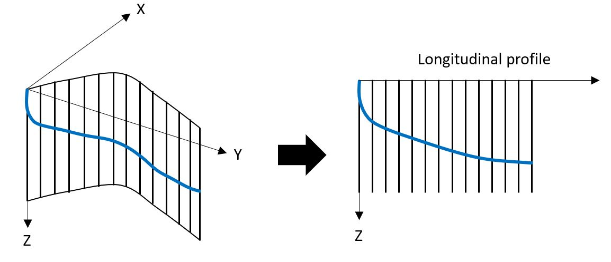

The hypothesis behind the minimum curvature method to calculate the position of a `Survey` is that the curved followed by the well is a circular arc.
This circular arc is contained in a plane defined by two vectors: the tangent of the starting `Survey` and the rotated vertical upward vector with the angle $\omega$
corresponding to the initial toolface of the circular arc using the tangent as the axis of the rotation. The projection of this circular arc on the horizontal plane
is an arc of an ellipse. This ellipse is defined by a center, a semi-long and a semi-short axes. The length of this arc of ellipse is the difference of curvilinear abscissas
in the longitudinal profile direction. To calculate the length of the arc of ellipse, it is necessary to recourse to an elliptical intergral of the second kind.

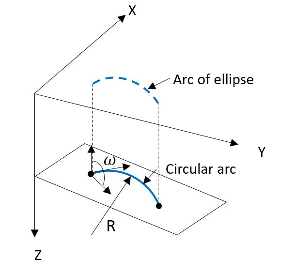

The class `Survey` defines two additional properties: `Latitude` (denoted here $\phi$) and `Longitude` (denoted here $\lambda$). This is 
because the drilling data model makes only use of globally defined values, meaning that a well position, i.e., a `Survey` must be defined uniquely
on the Earth. This is achieved by using `Latidude` and `Longitude` on the WGS84 spheroid, which is the reference Earth spheroid for all geodetic
conversions. Then remains the problem of what `X`, `Y` and `Z` mean when considering that they shall be defined globally for any position on the Earth.
It is desirable to keep the meaning of `Z` to be a depth in the vertical direction. Then `X` and `Y` should be somewhat related to `Latitude` and `Longitude`
but with a physical quantity of dimension Length. The solution adopted is that `X` is the length of the arc following the meridian at that 
`Longitude` and originating from the equator and counted positively in the North direction. Similarly, `Y` is the length of the arc following the parallel 
at that `Latitude` and originating from the Greenwich meridian and counted positively in the East direction. In other words, `X` and `Y` are coordinates
in a Riemannian manifold defined the Earth spheroid. Therefore two synonym properties are introduced: `RiemannianNorth`which corresponds to `X`
and RiemannianEast which corresponds to `Y`. 

As a reminder, a manifold is a topological space that locally resembles an Euclidian space near each point. A smooth
manifold is a differentiable manifold that is locally similar to a vector space to allow the application of calculus. A Riemannian manifold is a smooth manifold
equipped with a positive-definite inner product on the tangent space at each point of the manifold, and therefore that allows to work with metrics.

The next section explains how `Latitude` and `Longitude` are converted to `X` and `Y`.

## Conversion from Latitude-Longitude to Riemannian Coordinates
The earth is modelled as an oblate, i.e., a spheroid flatened at the pole. At a given latitude, a path on the Earth is a circle. Let us consider that the origin of 
longitudes is Greenwich and that the Earth is modelled by a semi-long axis, $a$, and a flatening, $f$. The flatening is defined as:
$$f = \frac{{a - b}}{{a}}$$
where $b$ is the semi-short axis. Therefore the semi short axis can be expressed as:
$$b = a - f \cdot a$$

The radius of the Earth at a given latitude, $\phi$ is given by:
$$R(\phi) = \cos{\phi}\sqrt{\frac{(a^2\cos{\phi})^2+(b^2sin{\phi})^2}{(a\cos{\phi})^2+(b\sin{\phi})^2}}$$


At that latitude the $y$-coordinate (east-west) is the length of the circular arc counted from the Greenwich meridian, i.e., the longitude angle, $\lambda$:
$y = R(\phi) \cdot \lambda$
The $x$-coordinate (south-north) is the length of the elliptical arc counted from the equator using the latitude. 
This involves the elliptic integral of the second kind, denoted $E(\phi, m)$ where $m=1- \frac{{b^2}}{{a^2}}$. 
Its definition is: $E(\phi, m) = \int_0^\phi \sqrt{1 - m \cdot \sin^2(t)} \, dt$.
The definition of $x$ is then: $x = a \cdot E(\phi, m)$.

Conversely, to retrieve the latitude and longitude from the $x$ and $y$ coordinates, i.e., arc lengths, the following method is used:
$\phi = E^{-1}(\frac{x}{a}, m)$ and $\lambda = \frac{y}{R(\phi)}$.

The elliptic integral of the second kind is calculated using the special function defined in `OSDC.DotnetLibraries.General.Math`, 
namely `SpecialFunctions.EllipticE(phi, m)` and its inverse is `Elliptic.InverseEllipticE(x, m)`.

For short lateral displacements, considering that `X` and `Y` are cartesian coordinates does not introduce much error. This is actually what is assumed
by most Earth Model software used in E&P applications. So `X` and `Y` can be considered as respectively a sort of Northing and Easting coordinate.


## Conversion to Spherical Coordinate
At a given latitude, the radial distance to the centre (also called the geocentric radius) of the Earth is given by: 
$$r(\phi) = \frac{a}{\sqrt{1-e^2\sin^2{\phi}}$$

The radial position of the point is $r_p = r(\phi)-Z$ where $Z$ is the vertical depth at that point.

Knowing the radial position, the latitude and the longitude, it is possible to calculate the cartesian coordinates of the point in a global coordinate
system centered at the Earth center and with X, Y and Z directions that are fixed orthogonal axes attached to the Earth. The method `GetSphericalPoint` returns a `SphericalPoint3D`
in this cartesian reference system. The X-direction passes by the equator and the Greenwich meridian. The Y-direction passes by the equator and is 90deg east
for the Greenwich meridian. The Z-direction passed by the North pole.

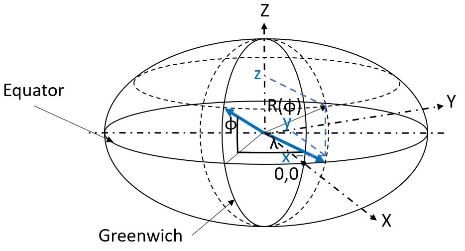

## Example of Riemannian and Cartesian coordinate transformation from Latitude and Longitude

Here is an example of a short program that takes `Survey` described in `Latitude`, `Longitude` and `TVD` and that displays the conversion
in the Riemannian space and in the Cartesian space.

<pre>
```csharp
using OSDC.DotnetLibraries.Drilling.Surveying;
using OSDC.DotnetLibraries.General.Math;
using System.Globalization;

namespace DrillingProperties
{
    class Example
    {
        static void Main()
        {
            // a underground position at Norce, Stavanger, Norway
            Survey survey = new Survey() { TVD = 500, Latitude = 58.93438 * System.Math.PI / 180.0, Longitude = 5.70725 * System.Math.PI / 180.0 };
            Console.WriteLine("RiemannianNorth: " + survey.RiemannianNorth?.ToString("F3", CultureInfo.InvariantCulture) + " m, RiemannianEast: " + survey.RiemannianEast?.ToString("F3", CultureInfo.InvariantCulture) + " m");

            SphericalPoint3D? sphericalPoint3D = survey.GetSphericalPoint();
            if (sphericalPoint3D != null)
            {
                Console.WriteLine("CartesianX: " + sphericalPoint3D.X?.ToString("F3", CultureInfo.InvariantCulture) + " m, CartesianY: " + sphericalPoint3D.Y?.ToString("F3", CultureInfo.InvariantCulture) + " m, CartesianZ: " + sphericalPoint3D.Z?.ToString("F3", CultureInfo.InvariantCulture) + " m");
            }
        }
    }
}
```
</pre>

The execution result is:

<pre>
RiemannianNorth: 6560503.255 m, RiemannianEast: 635328.164 m
CartesianX: 3284101.435 m, CartesianY: 328216.605 m, CartesianZ: 5478668.203 m
</pre>

## Distance on a Riemaniann Manifold
The distance between two points on an oblate can be calculated using the inverse problem algorithm described by Vincenty 
[doi:10.1179/sre.1975.23.176.88](https://doi.org/10.1179/sre.1975.23.176.88) and 
[doi:10.5281/zenodo.32999](https://doi.org/10.5281/zenodo.32999). 

It remains to find the distance between two points that are not at 0 TVD and not necessarily at the same TVD either.

First, let us consider the effect of depth in the Riemaniann manifold perspective. As TVD is directed to the center of the Earth,
it has been shown that the radial distance to the center of the planet is: $r-Z = \frac{a}{\sqrt{1-e^2 \sin(\phi)}}-Z$. Let us
consider the equivalent semi-long axis of a prolate, $a'$ with the same eccentricity that passes through this radial distance to the center
of the Earth: $r-Z =\frac{a'}{\sqrt{1-e^2 \sin(\phi)}}$, which means that $a'=a-Z.\sqrt{1-e^2 \sin(\phi)}$.
It is from now on possible to attach a prolate with the same eccentricity as the one of WGS84 to any vertical depth.

Let us consider that two points are at the same vertical depth but not on the WGS84 spheroid. Then it is possible to calculate
the Riemaniann distance between these two points using the Vicenty algorithm. The deepest wells that have build drilled are in the
range of 12 km. The largest departure for a well is in the range of 15 km. Let us consider two points on the WGS84 spheroid that
are distant by about 15 km. Each of them has a latitude and longitude. Then, we can calculate the difference of length
between two points distant from about 15 km when using a vertical depth of 0 and a vertical depth of 12 km. 

## Minimum Curvature Method and Interpolation between two `Survey`
The minimum curvature method can be used to calculate the spatial position of a point from a previous and a measurement of `MD`, `Inclination` and `Azimuth`.
The method is called `CompleteSIA`. The calculation uses equations (9), (10) and (11) of the paper by Sawaryn and Thorogood (2005) ([https://doi.org/10.2118/84246-PA](https://doi.org/10.2118/84246-PA))

When the argument is a `Survey`, it also calculates `Curvature`, `Toolface`, `BUR` and `TUR`. The `Toolface` is calculated using eq. (48) from the paper by 
Sawaryn and Thorogood (2005) ([https://doi.org/10.2118/84246-PA](https://doi.org/10.2118/84246-PA)). Since the toolface, the build-up rate and the turn-rate are not constant along a circular arc, a 
`CurvilinearPoint3D` is interpolated 0.1 m before the final point on the circular arc and the toolface is calculated between that interpolated point and the final point. Similarly,
the build-up rate and the turn rate are usually not constant along a circular arc. Therefore they are estimated between the interpolated point and the final point 
of the circular arc.

There is also a method to interpolate either a `CurvilinearPoint3D` or a `Survey` in between a `Survey` and `ICurvilinear3D` using the minimum curvature method. This is method
is called `InterpolateAtAbscissa`. If the requested result is a `Survey`, then the `Curvature`, `Toolface`, `BUR` and `TUR are also calculated locally.

Here is an example illustrating how these methods can be used.

<pre>
```csharp
using OSDC.DotnetLibraries.Drilling.Surveying;
using OSDC.DotnetLibraries.General.Common;
using System.Globalization;

namespace DrillingProperties
{
    class Example
    {
        static void Main()
        {
            // an underground position at Norce, Stavanger, Norway
            Survey survey1 = new Survey() { TVD = 100, Latitude = 58.93438 * System.Math.PI / 180.0, Longitude = 5.70725 * System.Math.PI / 180.0, MD = 100.0, Inclination = 0, Azimuth = 0 };
            Survey survey2 = new Survey() { MD = 130.0, Inclination = 2.0 * Numeric.PI / 180.0, Azimuth = 30.0 * Numeric.PI / 180.0 };
            if (survey1.CompleteSIA(survey2))
            {
                Console.WriteLine("Calculated displacements: dZ= " + (survey2.TVD - survey1.TVD)?.ToString("F3", CultureInfo.InvariantCulture) +
                    " m, dNorth= " + (survey2.RiemannianNorth - survey1.RiemannianNorth)?.ToString("F3", CultureInfo.InvariantCulture) +
                    " m, dEast= " + (survey2.RiemannianEast - survey1.RiemannianEast)?.ToString("F3", CultureInfo.InvariantCulture) + " m");
                Survey survey3 = new Survey();
                survey1.InterpolateAtAbscissa(survey2, 110.0, survey3);
                Console.WriteLine("Interpolated survey: dZ= " + (survey3.TVD - survey1.TVD)?.ToString("F3", CultureInfo.InvariantCulture) +
                    " m, dNorth= " + (survey3.RiemannianNorth - survey1.RiemannianNorth)?.ToString("F3", CultureInfo.InvariantCulture) +
                    " m, dEast= " + (survey3.RiemannianEast - survey1.RiemannianEast)?.ToString("F3", CultureInfo.InvariantCulture) +
                    " m, Inclination= " + (survey3.Inclination * 180.0 / Numeric.PI)?.ToString("F3", CultureInfo.InvariantCulture) +
                    " °, Azimuth= " + (survey3.Azimuth * 180.0 / Numeric.PI)?.ToString("F3", CultureInfo.InvariantCulture) +
                    " °, Curvature= " + (survey3.Curvature * 180.0 * 30.0 / Numeric.PI)?.ToString("F3", CultureInfo.InvariantCulture) +
                    " °/30m, Toolface= " + (survey3.Toolface * 180.0 / Numeric.PI)?.ToString("F3", CultureInfo.InvariantCulture) +
                    " °, BUR= " + (survey3.BUR * 180.0 * 30.0 / Numeric.PI)?.ToString("F3", CultureInfo.InvariantCulture) +
                    " °/30m, TUR= " + (survey3.TUR * 180.0 * 30.0 / Numeric.PI)?.ToString("F3", CultureInfo.InvariantCulture) +
                    " °/30m");
            }
        }
    }
}
```
</pre>

And the execution result is:
<pre>
Calculated displacements: dZ= 29.994 m, dNorth= 0.453 m, dEast= 0.262 m
Interpolated survey: dZ= 10.000 m, dNorth= 0.050 m, dEast= 0.029 m, Inclination= 0.667 °, Azimuth= 30.000 °, Curvature= 2.000 °/30m, Toolface= 30.000 °, BUR= 2.000 °/30m, TUR= 0.000 °/30m
</pre>

# A Plain Trajectory: `SurveyList`
The class `SurveyList` represents a plain trajectory, i.e., a list of `Survey`. It is sub-class of `List<Survey>`. There is a `Calculate` method to 
calculate the `Survey` incrementally from the first one. The first survey of the list must be complete, i.e., with a defined `MD`, `Inclination`, `Azimuth`,
`TVD`, `RiemannianNorth`, `RiemannianEast`. 

There is also an `InterpolateAtAbscissa` method to obtain an interpolated `Survey` at any given `Abscissa`. The `Abscissa` must be between the first and 
last `Survey` of the `SurveyList`. The interpolation is based the minimum curvature method.

It is also possible to obtain a method to obtain a reinteropolated `SurveyList` based on an interpolation step and possibly a list of required abscissas.

Here is an example showing how to define a `SurveyList`, calculate it and obtain an interpolated `SurveyList`.

<pre>
```csharp
using OSDC.DotnetLibraries.Drilling.Surveying;
using OSDC.DotnetLibraries.General.Common;
using System.Globalization;

namespace DrillingProperties
{
    class Example
    {
        static void Main()
        {
            // an underground position at Norce, Stavanger, Norway
            double groundLevel = 39.7;
            Survey survey1 = new Survey() { TVD = -groundLevel, Latitude = 58.93414 * System.Math.PI / 180.0, Longitude = 5.7085 * System.Math.PI / 180.0, MD = -groundLevel, Inclination = 0, Azimuth = 0 };
            SurveyList traj = new SurveyList() { survey1,
                new Survey() { MD = 50.0 - groundLevel, Inclination = 0.9 * Numeric.PI / 180.0, Azimuth = -29.7 * Numeric.PI / 180.0 },
                new Survey() { MD = 100.0 - groundLevel, Inclination = 0.4 * Numeric.PI / 180.0, Azimuth = -95.1 * Numeric.PI / 180.0 },
                new Survey() { MD = 150.0 - groundLevel, Inclination = 0.7 * Numeric.PI / 180.0, Azimuth = 142.5 * Numeric.PI / 180.0 },
                new Survey() { MD = 200.0 - groundLevel, Inclination = 0.9 * Numeric.PI / 180.0, Azimuth = 58.2 * Numeric.PI / 180.0 },
                new Survey() { MD = 250.0 - groundLevel, Inclination = 0.6 * Numeric.PI / 180.0, Azimuth = 173.2 * Numeric.PI / 180.0 },
                new Survey() { MD = 300.0 - groundLevel, Inclination = 1.3 * Numeric.PI / 180.0, Azimuth = 143.6 * Numeric.PI / 180.0 },
                new Survey() { MD = 350.0 - groundLevel, Inclination = 6.6 * Numeric.PI / 180.0, Azimuth = 155.6 * Numeric.PI / 180.0 },
                new Survey() { MD = 400.0 - groundLevel, Inclination = 11.2 * Numeric.PI / 180.0, Azimuth = 143.7 * Numeric.PI / 180.0 },
            };
            if (traj.Calculate())
            {
                Console.WriteLine("Calculated Trajectory");
                PrintTrajectory(traj);
                SurveyList interpolatedTraj = traj.Interpolate(10.0, new List<double>() { 229.0- groundLevel });
                if (interpolatedTraj != null)
                {
                    Console.WriteLine("Interpolated Trajectory");
                    PrintTrajectory(interpolatedTraj);
                }
            }
        }
        static void PrintTrajectory(SurveyList? traj)
        {
            if (traj != null)
            {
                Console.WriteLine("MD (m)\tIncl (°)\tAz (°)\tTVD (m)\tRiem. North (m)\tRiem. East (m)\tDLS (°/30m)\tToolface (°)\tBUR (°/30m)\tTUR (°/30m)");
                foreach (var sv in traj)
                {
                    if (sv != null)
                    {
                        if (sv.Curvature != null && sv.Toolface != null && sv.BUR != null && sv.TUR != null)
                        {
                            Console.WriteLine(sv.MD.Value.ToString("F3", CultureInfo.InvariantCulture) + "\t" +
                                (sv.Inclination.Value * 180.0 / Numeric.PI).ToString("F3", CultureInfo.InvariantCulture) + "\t" +
                                (sv.Azimuth.Value * 180.0 / Numeric.PI).ToString("F3", CultureInfo.InvariantCulture) + "\t\t" +
                                sv.TVD.Value.ToString("F3", CultureInfo.InvariantCulture) + "\t" +
                                sv.RiemannianNorth.Value.ToString("F3", CultureInfo.InvariantCulture) + "\t" +
                                sv.RiemannianEast.Value.ToString("F3", CultureInfo.InvariantCulture) + "\t" +
                                (sv.Curvature.Value * 30.0 * 180.0 / Numeric.PI).ToString("F3", CultureInfo.InvariantCulture) + "\t" +
                                (sv.Toolface.Value * 180.0 / Numeric.PI).ToString("F3", CultureInfo.InvariantCulture) + "\t" +
                                (sv.BUR.Value * 30.0 * 180.0 / Numeric.PI).ToString("F3", CultureInfo.InvariantCulture) + "\t" +
                                (sv.TUR.Value * 30.0 * 180.0 / Numeric.PI).ToString("F3", CultureInfo.InvariantCulture));
                        }
                        else
                        {
                            Console.WriteLine(sv.MD.Value.ToString("F3", CultureInfo.InvariantCulture) + "\t" +
                                (sv.Inclination.Value * 180.0 / Numeric.PI).ToString("F3", CultureInfo.InvariantCulture) + "\t" +
                                (sv.Azimuth.Value * 180.0 / Numeric.PI).ToString("F3", CultureInfo.InvariantCulture) + "\t\t" +
                                sv.TVD.Value.ToString("F3", CultureInfo.InvariantCulture) + "\t" +
                                sv.RiemannianNorth.Value.ToString("F3", CultureInfo.InvariantCulture) + "\t" +
                                sv.RiemannianEast.Value.ToString("F3", CultureInfo.InvariantCulture));
                        }
                    }
                }
            }
        }
    }
}
```
</pre>

The print out on the console looks like this:

<pre>
Calculated Trajectory
MD (m)  Incl (°)        Az (°)  TVD (m) Riem. North (m) Riem. East (m)  DLS (°/30m)     Toolface (°)    BUR (°/30m)     TUR (°/30m)
-39.700 0.000   0.000           -39.700 6560476.538     635467.313
10.300  0.900   -29.700         10.298  6560476.880     635467.119      0.540   90.000  0.540   -0.000
60.300  0.400   -95.100         60.295  6560477.205     635466.750      0.491   178.462 0.014   -70.337
110.300 0.700   142.500         110.294 6560476.947     635466.762      0.585   110.329 0.548   -16.631
160.300 0.900   58.200          160.290 6560476.912     635467.282      0.650   130.079 0.498   -26.657
210.300 0.600   173.200         210.288 6560476.859     635467.647      0.765   50.080  0.588   46.891
260.300 1.300   143.600         260.281 6560476.142     635468.014      0.500   110.873 0.467   -7.847
310.300 6.600   155.600         310.145 6560473.067     635469.539      3.201   87.087  3.197   1.415
360.300 11.200  143.700         359.534 6560466.533     635473.603      2.959   106.020 2.844   -4.203
Interpolated Trajectory
MD (m)  Incl (°)        Az (°)  TVD (m) Riem. North (m) Riem. East (m)  DLS (°/30m)     Toolface (°)    BUR (°/30m)     TUR (°/30m)
-39.700 0.000   0.000           -39.700 6560476.538     635467.313
-29.700 0.180   -29.700         -29.700 6560476.552     635467.305      0.540   -29.700 0.540   0.000
-19.700 0.360   -29.700         -19.700 6560476.593     635467.282      0.540   -29.700 0.540   0.000
-9.700  0.540   -29.700         -9.700  6560476.661     635467.243      0.540   -29.700 0.540   0.000
0.300   0.720   -29.700         0.299   6560476.757     635467.189      0.540   -29.700 0.540   0.000
10.300  0.900   -29.700         10.298  6560476.880     635467.119      0.540   -29.700 0.540   0.000
20.300  0.757   324.784         20.297  6560477.002     635467.042      0.491   -121.825        -0.417  -19.611
30.300  0.624   316.813         30.296  6560477.095     635466.966      0.491   -129.764        -0.377  -28.859
40.300  0.509   304.916         40.296  6560477.160     635466.893      0.491   -141.613        -0.305  -43.337
50.300  0.428   287.409         50.295  6560477.197     635466.821      0.491   -159.059        -0.175  -61.487
60.300  0.400   264.900         60.295  6560477.205     635466.750      0.491   178.462 0.014   -70.337
70.300  0.272   239.142         70.295  6560477.190     635466.695      0.585   -152.721        -0.266  -109.486
80.300  0.253   195.735         80.295  6560477.156     635466.669      0.585   163.932 0.164   -127.292
90.300  0.361   164.506         90.295  6560477.105     635466.671      0.585   132.489 0.432   -62.776
100.300 0.522   149.942         100.294 6560477.035     635466.702      0.585   117.815 0.517   -29.981
110.300 0.700   142.500         110.294 6560476.947     635466.762      0.585   110.329 0.548   -16.631
120.300 0.605   125.279         120.293 6560476.868     635466.843      0.650   -162.739        -0.192  -58.816
130.300 0.580   104.333         130.293 6560476.825     635466.935      0.650   176.333 0.043   -64.147
140.300 0.632   84.337          140.292 6560476.818     635467.039      0.650   156.305 0.262   -53.946
150.300 0.747   68.948          150.291 6560476.847     635467.154      0.650   140.866 0.411   -38.692
160.300 0.900   58.200          160.290 6560476.912     635467.282      0.650   130.079 0.498   -26.657
170.300 0.678   67.430          170.289 6560476.976     635467.403      0.765   -55.651 -0.631  36.482
180.300 0.490   84.581          180.289 6560477.003     635467.501      0.765   -38.614 -0.476  69.976
189.300 0.391   111.989         189.289 6560476.995     635467.567      0.765   -11.339 -0.148  109.964
190.300 0.387   115.700         190.289 6560476.992     635467.574      0.765   -7.636  -0.099  112.321
200.300 0.436   151.207         200.288 6560476.944     635467.622      0.765   27.948  0.360   88.902
210.300 0.600   173.200         210.288 6560476.859     635467.647      0.765   50.080  0.588   46.891
220.300 0.718   162.892         220.287 6560476.747     635467.671      0.500   130.221 0.382   -25.762
230.300 0.852   155.650         230.286 6560476.619     635467.720      0.500   122.956 0.419   -18.285
240.300 0.996   150.438         240.285 6560476.476     635467.794      0.500   117.728 0.442   -13.378
250.300 1.146   146.565         250.283 6560476.317     635467.892      0.500   113.845 0.457   -10.101
260.300 1.300   143.600         260.281 6560476.142     635468.014      0.500   110.873 0.467   -7.847
270.300 2.347   150.311         270.276 6560475.873     635468.183      3.201   81.778  3.168   11.177
280.300 3.407   152.868         280.263 6560475.431     635468.420      3.201   84.352  3.186   5.302
290.300 4.470   154.211         290.239 6560474.816     635468.725      3.201   85.699  3.192   3.080
300.300 5.535   155.039         300.201 6560474.027     635469.098      3.201   86.527  3.195   2.010
310.300 6.600   155.600         310.145 6560473.067     635469.539      3.201   87.087  3.197   1.415
320.300 7.487   152.071         320.069 6560471.968     635470.082      2.959   114.301 2.697   -9.345
330.300 8.395   149.294         329.974 6560470.765     635470.760      2.959   111.544 2.752   -7.441
340.300 9.320   147.059         339.854 6560469.457     635471.573      2.959   109.332 2.792   -6.048
350.300 10.256  145.227         349.709 6560468.047     635472.521      2.959   107.523 2.821   -5.003
360.300 11.200  143.700         359.534 6560466.533     635473.603      2.959   106.020 2.844   -4.203
</pre>

# SurveyStation
A `SurveyStation` is a subclass of `Survey`. It extends a `Survey` by adding a 3x3 covariance matrix and `Vector3D` `Bias`.
The covariance matrix represents the 3D gaussian probability distribution of the position of the `SurveyStation` in a 
local 3D space and with directions in the North, East and downward Vertical.
The `Bias` contains the possible mean values of this probability distribution relative to the position of the `SurveyStation`.

The class `SurveyStation` defines the following methods:
- `CalculateEllipsoid`: this method is used to calculate an ellipsoid of uncertainty at a given confidence factor. The ellipsoid
is defined by a `Vector3D` that contains the radii in the three principle components and a `Matrix3x3` that contains the eigen
vectors. The ellipsoid can be expanded by the borehole radius and it can be increased by a scaling factor. The scaling factor 
is typically used when searching for the safety factor between two `SurveyStationList`.
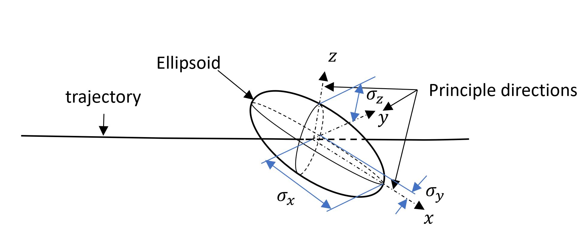
- `CalculateHorizontalEllipse`: this method calculates the horizontal projection of the ellipsoid. The result is provided with
2 radii stored in a `Vector2D` and an angle compared to the true north. A scaling factor and the borehole radius can be
used in the calculation of the ellipse.
- `CalculateVerticalEllipse`: this method calculates the vertical projection of the ellipsoid. The result is stored as 2 
radii in a `Vector2D`and an angle compared to the downward vertical. A scaling factor and the borehole radius can be integrated
to the ellipse calculation.
- `CalculatePerpendicularEllipse`: this method calculates the projection of the ellipsoid in a perpendicular plane to the tangent
at that `SurveyStation`. The calculated ellipse is store as 2 radii in a `Vector2D` and an angle compared to the upward vertical.
A scaling factor and the borehole radius can be integrated to the ellipse calculation.
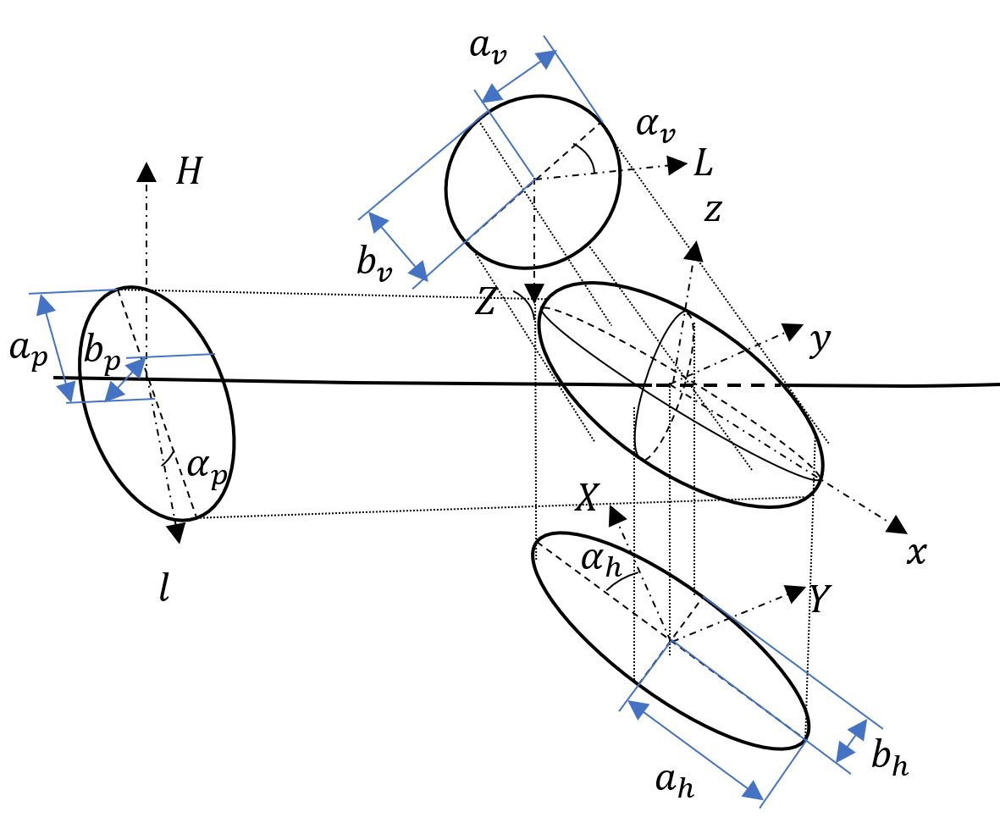
- `CalculateExtremumsInDepth`: this method calculates two `Point3D`: one is the shallowest of the ellipsoid, and the other one
is the deepest point on the ellipsoid. The algorithm is based on the description found in Cayeux et al. (2014) 
[https://doi.org/10.2118/170330-MS](https://doi.org/10.2118/170330-MS)

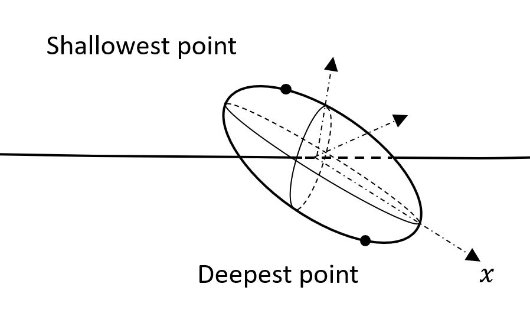

# SurveyStationList
A `SurveyStationList` is a list of `SurveyStation`. It provides the following methods:
- `Calculate`: this method calulates the position of each `SurveyStation` using the minimum curvature method.
- `Realize`: this method is used to draw randomly a `SurveyList` based on the covariance matrices at each `SurveyStation` of the `SurveyStationList`
- `EnvelopeOfUncertainty`: this method is used to obtain an envelope of uncertainty at a given confidence factor. 
- `HorizontalUncertainties`: this method is used to obtain a list of horizontal projections of the ellipsoid of uncertainties at a given confidence factor.
- `VerticalUncertainties`: this method is used to obtain a list of vertical projections of the ellipsoid of uncertainties at a given confidence factor.
- `ExtremumInDepthSurveyLists`: this method is used to obtain a high- and low- side `SurveyList` corresponding to the shallowest and deepest points of the ellipsoid of uncertainty at a given confidence factor.

## Realization of a SurveyStationList
A `SurveyStationList` has covariance matrices for each of its `SurveyStation`, meaning that a true trajectory can be anywhere in the surrounding of the
`SurveyStationList`. Yet, the covariance matrices correspond mostly to systematic errors that are probagated all along the series of measurements. So a realized
trajectory must respect a consistency compared to those covariance matrices. The method `Realize` produces a `SurveyList`, i.e., a list of `Survey`. There is
indeed no needs anymore to have information about the covariances in the realized trajectory. The generation algorithm is the following:

1. The last `SurveyStation` of the `SurveyStationList`, indexed $n$, is used to draw randomly a point according to the probability distribution associated with this `SurveyStation`.
For that purpose, the covariance matrix is diagonalized and the principal components are calculated. The eigenvalues are the variances in the three principal
directions, ${\sigma_{x_n}}^2, {\sigma_{y_n}}^2, {\sigma_{z_n}}^2$, with $x_n, y_n, z_n$ being the local coordinate system along the principal directions at the `SurveyStation` $n$. 
Three Gaussian probability distributions are created with zero mean and a variance equal to the eigen values, 
$\mathcal{N}(0,{\sigma_{x_n}}^2),  \mathcal{N}(0,{\sigma_{y_n}}^2), \mathcal{N}(0,{\sigma_{z_n}}^2)$. Three values are drawn using these probability distributions, 
$x_n, y_n, z_n$ . The $\chi^2_{3_n}$ corresponding to this position is calculated using the following relation: 
$${\frac{x_n^2}{{\sigma_{x_n}}^2}+\frac{y_n^2}{{\sigma_{y_n}}^2}+\frac{z_n^2}{{\sigma_{z_n}}^2}}={\chi^2_{3_n}}$$. The calculated $\chi^2_{3_n}$
is related to the confidence factor that the true `Survey` is within the ellipsoid delineated by $\chi^2_{3_n}$. The latitude and longitude
of that point are calculated using an instance of `SphericalPoint3D`. They are denoted respectively $\phi_n$ and $\lambda_n$. The 
randomly drawn point around the `SurveyStation` is then converted to a `Survey` in the Riemaniann manifold representing the Earth, using
the inverse transformation based on the eigenvectors.

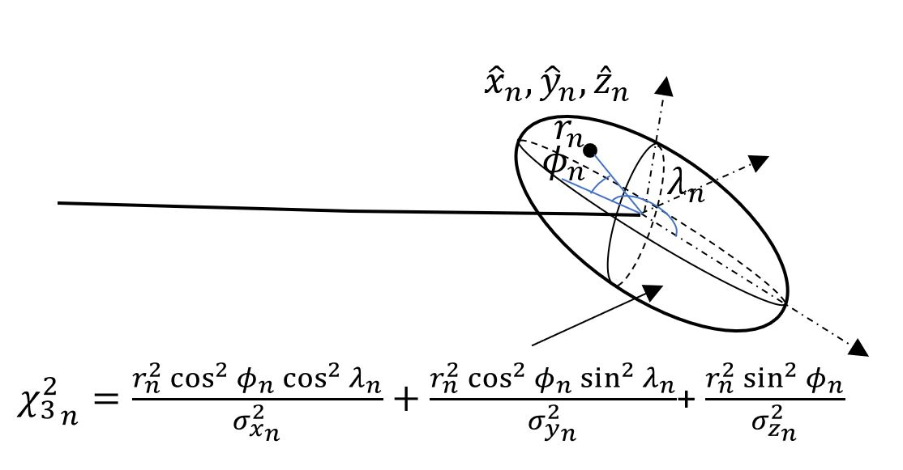

2. Iteratively and in the upward direction, other `Station` are calculated using $\phi_n$ and $\lambda_n$ and a radial distance 
calculated using the ellipsoid of uncertainty defined by $\chi^2_{3_n}$, i.e., 
$$r^2_i=\frac{\chi^2_{3_n}}{\frac{\cos{\phi_n}^2.\cos{\lambda_n}^2}{{\sigma_{x_i}}^2}+\frac{\cos{\phi_n}^2.\sin{\lambda_n}^2}{{\sigma_{y_i}}^2}+\frac{\sin{\phi_n}^2}{{\sigma_{z_i}}^2}}$$
where ${\sigma_{x_i}}^2, {\sigma_{y_i}}^2, {\sigma_{z_i}}^2$ are the variance in the principal directions at `SurveyStation` $i$. $r_i$ is the 
radial distance, in the coordinate system oriented by the principle directions at the `SurveyStation` $i$.
Of course, this `SphericalPoint3D` is defined in the local coordinate system directed by the principal components of the covariance
matrix of the `SurveyStation`. Having retrieved the $x_i$, $y_i$ and $z_i$ components of the point in the local coordinate system,
it is transformed to the Riemannian manifold coordinates using the inverse transformation based on the eigen vectors of the covariance
matrix. This operation generates a list of `Survey` for which the `RiemaniannNorth`, `RiemaniannEast` and `TVD` are filled in.

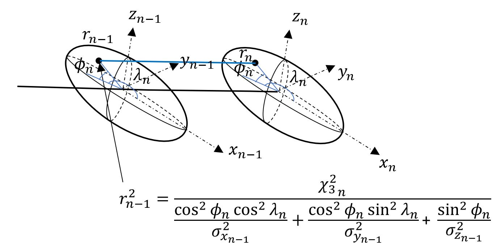

3. The last operation consists in calculating the `Inclination`, `Azimuth` and `Abscissa` at each `Survey`. From top to bottom, the list
is transversed and a circular arcj is calculated that links the previous `Survey`, which is fully defined, with the current `Survey`, 
which is only known by its `RiemaniannNorth`, `RiemaniannEast` and `TVD`. Knowing the circular arc, it is the possible to calculate the
length of the arc, i.e., derive the `Abscissa`, the `Inclination` and the `Azimuth`.

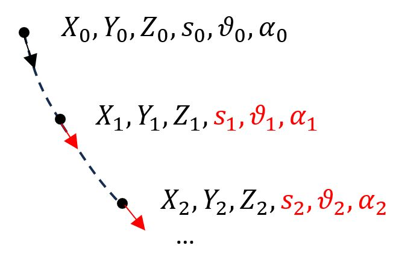

## Calculation of the envelope of uncertainty of a SurveyStationList
It is possible to define a scaling factor and a list of wellbore radii per depth range. The scaling factor is used when searching for the
safety factor between two `SurveyStationList`. The envelope of uncertainty is constructed using the perpendicular projections
of the ellipsoids of uncertainty at the given confidence factor. Each ellipse is discretized as a polygon. The number of
vertices of the polygons is passed as argument to the function call. 

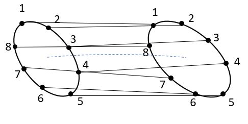

It can happen that there is a half rotation of the indices of the polygons from one `SurveyStation` to the next one. 
To avoid this problem, the distance between the first vertex of the previous ellipse is calculated to all the vertices of the next ellipse.
The shortest distance indicates which vertex of the next ellipse shall be considered as the first one.

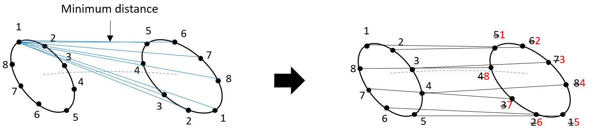

## Horizontal and Vertical Projections of the Ellipsoids
Two methods are available to generate series of horizontal and vertical projections of the ellipsoids at a given confidence factor. 

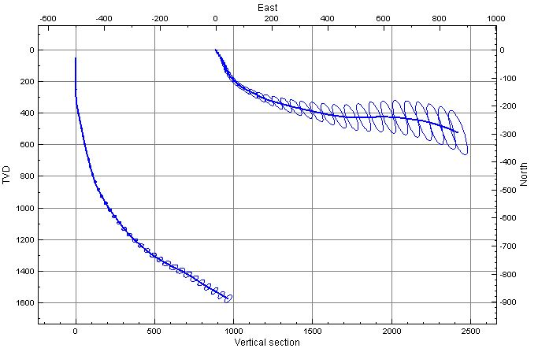

## Extremum Survey lists in Depth
Two `SurveyList` can be calculated corresponding to the shallowest and the deepest trajectories at a given confidence factor. The last survey point
is used to calculate the shallowest and deepest TVD on the ellipsoid of uncertainty. The corresponding latitude and longitude of those points in 
the local reference frame of the ellipsoide are then used to generate the `SurveyList` in an identical way as the realization of `SurveyList` using 
the `Covariance` matrices.

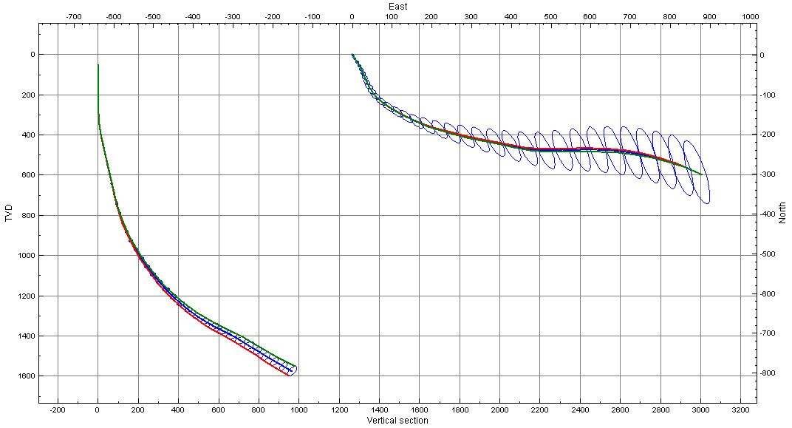

# Octree Discretization

## Octree Encoding of the Envelope of Uncertainty of SurveyStationList


